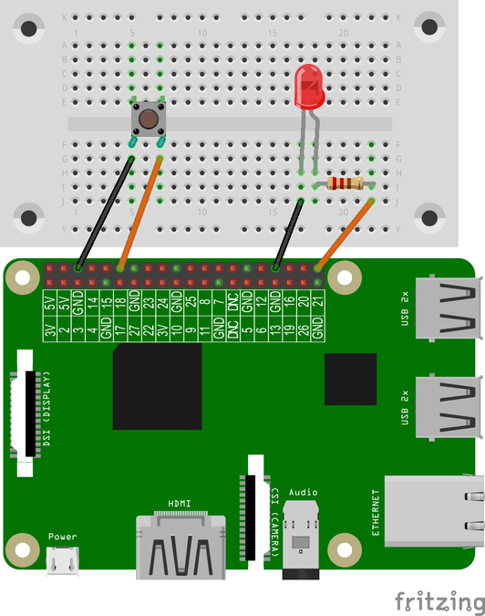

# Computerspiel Schnelligkeit
## Material
* 1x LED
* 1x 220 Ohm Widerstand
* 1x Taster
* 4x Kabel
* 1x Steckbrett


<div style="page-break-after: always;"></div>
## Aufbau
Wir verwenden die Schaltung aus dem Schritt „LED mit einem Taster schalten“ für das Computerspiel Schnelligkeit.




>**Scratch**: `led_spiel.sb` in deinem Projekt-Ordner für Scratch.
>
>**Python**: `led_spiel.py` in deinem Projekt-Ordner für Python.

<div style="page-break-after: always;"></div>

## Scratch-Programm


Mit dem Block **config21out** wird der GPIO-Pin 21 als Ausgang definiert. An diesem GPIO-Pin ist die LED angeschlossen. Mit config14in wird der GPIO-Pin für den Taster als Eingang definiert. Wir legen noch zwei eigene Variablen an: **zeit, ergebnis** Das Programm lässt die LED zufällig lang (zwischen 5 und 5 Sekunden) leuchten und schaltet die LED mit gpio21off wieder aus. Die Schleife prüft, ob der Taster (**Wert von Sensor gpio14=0**) gedrückt wird. Wenn die Bedingung erfüllt ist, wird die Variable zeit als Ergebnis angezeigt und das Programm beendet. Sonst wird die Variable zeit um 0,1 Sekunden erhöht und die Schleife wartet auch 0,1 Sekunden bevor diese wiederholt wird.

## Python – Programm
```python
import RPi.GPIO as GPIO #Import der notwendigen Bibliotheken
GPIO.setmode(GPIO.BCM)
GPIO.setwarnings(False) #Warnungen abschalten
from time import sleep
from random import uniform #Import der Bibliothek für die Zufallszahlen
LED_Pin = 21 #LED ist am GPIO-Pin 21 angeschlossen
GPIO.setup(LED_Pin, GPIO.OUT) #Pin21 wird als Ausgabe definiert
TasterPin = 14
GPIO.setup(TasterPin, GPIO.IN, pull_up_down=GPIO.PUD_UP)
GPIO.output(LED_Pin, GPIO.HIGH) #LED ein schalten
sleep(uniform(5, 10)) #per Zufallszahl zwischen 5 und 10 sek warten
GPIO.output(LED_Pin, GPIO.LOW) #LED aus schalten
zeit = 0.1
while True: #Schleife (Wiederholung)
    if GPIO.input(TasterPin) == False:
        print("Ergebnis %.2f Sekunden." % (zeit))
        break #Programm beenden
    else:
        zeit = zeit + 0.1 #Zeit läuft weiter
        sleep(0.1)
```
