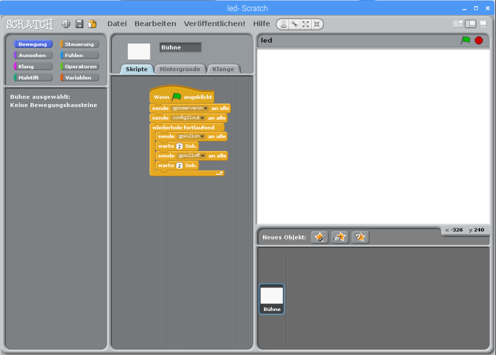

## Downloads zum Scoutlab Session Kit 1
>Die verwendeten Programme & Anleitungen findest du unter http://www.scoutlab.de/kit zum Download.
Entpacke die Dateien aus dem ZIP-Archiv in das Verzeichnis /home/pi auf deinem Raspberry Pi.
Die Scratch-Beispiele findest du im Verzeichnis scratch.
Die Python-Beispiele findest du dann im Verzeichnis python.

>Die im Scoutlab-Session Kit 1 beschriebenen Experimente funktionieren mit den Raspberry Pi-Modellen A+, B+, Raspberry Pi 2 und Raspberry Pi 3.

## Scratch verwenden
Starte das Scratch-Programm, indem Du auf Menü klickst, gefolgt von Entwicklung und dann Scratch auswählen

### Starten eines Scratch-Programms

Sobald du dein Programm geöffnet hast, musst du auf die grüne Fahne klicken, um das Programm zu starten.

