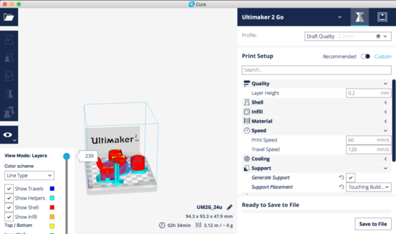

# 3D-Druck Workshop

<!-- TODO: Add Images -->

Im Rahmen des 3D Druck Workshops sollen die Teilnehmer\*innen an Grundlagen das 3D Druckens herangeführt werden. Am Beispiel eines Halstuch Rings werden sie erste 3D Objekte am Computer erstellen und am Ende mit dem 3D Drucker ausdrucken.

## Vorraussetzungen
Folgende Materialien und Werkzeuge sollten zur Verfügung stehen:

- 3D Drucker
- 1 Laptop für 2 Teilnehmer\*innen (mit Chrome Browser)
- Internet Verbindung

Altersgruppe: ab 11 Jahre

Zeit: 2 Std.

Es ist wichtig, dass die\*der Workshopleiter\*in sich mit der Software auseinander setzt um bei aufkommenden Fragen den Teilnehmer\*innen helfen zu können.

## Einleitung

3D-Drucken ist ein drei stufiger Prozess. Im ersten Schritt muss ein 3D-Modell erstellt werden. Hierzu eignen sich 3D CAD Anwendungen wie z.B. [TinkerCAD](http://tinkercad.com), [AutoCAD Fusion 360](https://www.autodesk.de/products/fusion-360/overview) oder [Blender](https://www.blender.org/). Im weiteren verlauf des Workshops werden wir TinkerCAD verwenden. Es ist ein  Browser basiertes 3D CAD Programm für Einsteiger.

Sobald das 3D Modell in Form einer STL Datei vorliegt, kann es im Slicer für den 3D-Drucker vorbereitet werden. Der Slicer zerschneidet das Modell in Schichten und erzeugt konkrete Kommandos für den Drucker.

Der erzeugte gcode (die Drucker Kommandos) werden dann via SD Karte, Wifi oder USB Kabel an den Drucker übertragen und der Druck kann beginnen.

## Durchführung

Bevor wir mit der Modellierung beginnen, sollte die Idee das aufgezeichnet werden und alle relevanten Abmessungen ermittelt werden.

Anschliessend gibt die\*der Gruppenleiter\*in eine kleine Einführung in das Tool TinkerCAD. Vor allem die unterschiedlichen Sichten sollten verdeutlicht werden, da es entscheidend ist, von wo man auf das Objekt sieht.

  In TinkerCAD kann man zwischen ortogonaler Ansicht und perspektivischer Ansicht umschalten. Während der Konstruktion macht es Sinn die ortogonale Ansicht zu wählen.

Sobald die Teilnehmer\*innen mit der Oberfläche vertraut sind, kann der Halstuchring gestaltet werden. Im Wesentlichen Besteht er aus einem Zylinder und einer Box, die mit einem Zylinder "Loch" kombiniert werden.

Sobald der Basisring fertig ist, kann er von den Teilnehmer*innen weiter verfeinert werden. Möglich ist z.B. einen Buchstaben, das Sippenabzeichen oder die VCP Zeichen am Schild zu montieren. Des weiteren können die Ecken des Rings abgerundet werden oder komplett eigene Formen (e.g. ein Herz) für den Ring verwendet werden.

Etwa eine halbe Stunde vor Ende der Gruppenstunde sollten alle Dateien zentral gesammelt werden und mit der Slicer Software für den Druck vorbereitet werden.

## Druck

Da es sehr viele unterschiedliche Drucker Typen gibt, sollte sich der\*die Workshopleiter\*in mit dem Drucker und der Slicer Software vertraut machen. Beispielhaft werden die Notwendigen Schritte für den Ultimaker 2 Go und Cura hier vorgestellt.

Um Zeit zu sparen, sollten so viele Halstuchringe, wie möglich, gleichzeitig gedruckt werden. Hierzu importiert man die STL Dateien und positioniert sie auf der Druckplatte. Unter Umständen macht es Sinn, das Objekt zu rotieren um die Anzahl der Überhänge zu minimieren.

Abweichend von den Standard Einstellungen haben sich folgende Optionen bewährt.

- Buildplate athesion: brim, 8mm
- Support Material: yes

Anschließend kann das Projekt auf der SD-Karte des Druckers gespeichert werden.

Am Drucker sollte zunächst die Druckplatte ausgerichtet werden. Anschließend können sich die Teilnehmer\*innen eine Druck Farbe aussuchen und das passende Filament am Drucker einlegen.

Sobald alle Vorbereitungen abgeschlossen sind, sollte die Druckplatte gereinigt werden und der Druck gestartet. Die Teilnehmer\*innen können die Resultate später am Tag oder in der nächste Gruppenstunde abholen.
