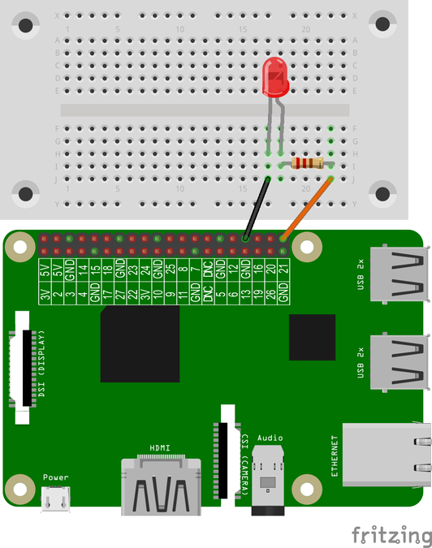
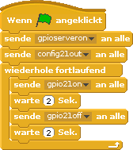

# LED mit einem Programm schalten
## Material
* 1x LED
* 1x 220 Ohm Widerstand
* 2x Kabel
* 1x Steckbrett


<div style="page-break-after: always;"></div>

## Aufbau



>**Scratch**: `led.sb` in deinem Projekt-Ordner für Scratch.
>
>**Python**: `led.py` in deinem Projekt-Ordner für Python.

<div style="page-break-after: always;"></div>

## Scratch-Programm 



Der Block **gpioserveron**  startet den notwendigen GPIO-Server, damit das Programm die GPIO-Pins nutzen kann. Mit dem Block **config21out** wird der GPIO-Pin 21 als Ausgang definiert. An diesem GPIO-Pin ist die LED angeschlossen. Jeder GPIO-Pin kann entweder Ausgang oder Eingang sein. Eine fortlaufend wiederholende Schleife schaltet mit **gpio21on** die LED ein. Wartet zwei Sekunden und schaltet mit **gpio21off** die LED wieder aus. Wartet zwei Sekunden und die Schleife beginnt wieder vorne. Die Schleife wird endlos wiederholt bis der Benutzer das Programm anhält.
<div class="hidden-print" style="margin-top:1em;">
<iframe src="https://player.vimeo.com/video/224094828" width="640" height="360" frameborder="0" webkitallowfullscreen mozallowfullscreen allowfullscreen></iframe></div>

<div style="page-break-after: always;"></div>
## Python-Programm

```python
import RPi.GPIO as GPIO #Import der notwendigen Bibliotheken
GPIO.setmode(GPIO.BCM)
GPIO.setwarnings(False) #Warnungen abschalten
from time import sleep
LED_Pin = 21 #LED ist am GPIO-Pin 21 angeschlossen
GPIO.setup(LED_Pin, GPIO.OUT) #Pin21 wird als Ausgabe definiert
while True: #Schleife (Wiederholung)
    GPIO.output(LED_Pin, GPIO.HIGH) #LED ein schalten
    sleep(2) #2 sek warten
    GPIO.output(LED_Pin, GPIO.LOW) #LED aus schalten
    sleep(2) #2 sek warten
    #nun wird die LED nach 2 Sekunden wieder eingeschaltet…
```

### Module und „import“-Funktion
Zusatzfunktionen sind in Form von Modulen in Python umgesetzt. Diese Module müssen vor ihrer Verwendung importiert werden. Der Befehl: from time import sleep importiert nur die Funktion sleep aus dem time Modul.
GPIO-Zugriff mit RPi.GPIO
Beim Import des GPIO-Moduls ist es ratsam, mit as GPIO ein Kürzel zu definieren.
So musst du nicht nicht beim jedem Zugriff auf die Funktion RPi.GPIO eingefügt werden muss.
```python
import RPi.GPIO as GPIO
GPIO.setmode ( GPIO.BCM )
Mit dem Befehl GPIO.setwarnings ( False ) werden unschöne Warnungen ausgeblendet.
```
Für jeden verwendeten GPIO-Pin musst du mitteilen, wie du den GPIO-Pin im Skript nutzen möchtest. Dazu gibst du mit setup an, ob du den GPIO-Pin zur Ein- oder zur Ausgabe verwenden möchtest. In diesem Beispiel nutzen wir eine LED als Ausgabe:
```python
GPIO.setup(LED_Pin, GPIO.OUT)
GPIO-Pin einschalten bzw. ausschalten
GPIO.output(LED_Pin, GPIO.HIGH) #LED ein schalten
GPIO.output(LED_Pin, GPIO.LOW) #LED aus schalten
```
### Schleifen (while)
Schleifen können mit while formuliert werden. Die eingerückten Anweisungen werden dann so lange ausgeführt, wie die Bedingung erfüllt ist.
Hier: while True: Solange das Skript ausgeführt wird, ist die Bedingung erfüllt. Die eingerückten Anweisungen werden so lange ausgeführt, bis du Strg + C zum Abbruch drückst.
