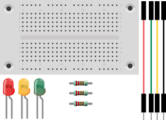
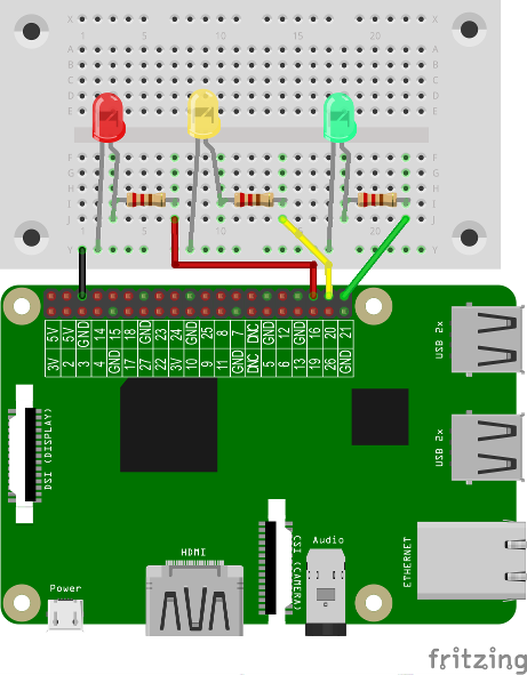
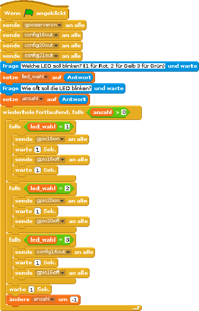

# LEDs über Benutzer-Eingaben steuern
## Material
* 1x LED rot
* 1x LED gelb
* 1x LED grün
* 3x 220 Ohm Widerstand
* 4x Kabel
* 1x Steckbrett



## Aufbau




>**Scratch**: `eingabe.sb` in deinem Projekt-Ordner für Scratch.
>
>**Python**: `eingabe.py` in deinem Projekt-Ordner für Python.

## Scratch-Programm



Der Block **gpioserveron**  startet den notwendigen GPIO-Server, damit das Programm die GPIO-Pins nutzen kann. Mit dem Blöcken **config16out config20out config21out** werden die GPIO-Pins 16,20 und 21 als Ausgang definiert. Am GPIO-Pin 16 ist die rote LED, am GPIO-Pin 20 ist die gelbe LED und am GPIO-Pin 21 die grüne LED, angeschlossen. Wir legen noch zwei eigene Variablen an: led_wahl, anzahl
Wir erstellen zwei Fragen:
Welche LED soll blinken? (1 für Rot, 2 für Gelb, 3 für Grün) → Antwort liefert die Variable led_wahl
Wie oft soll die LED blinken? → Antwort liefert die Variable anzahl
Eine fortlaufend wiederholende Schleife wird nur wiederholt, wenn die Variable anzahl > 0 ist.
Falls die Variable  led_wahl = 1 ist, dann blinkt die rote LED
Falls die Variable  led_wahl = 2 ist, dann blinkt die gelbe LED
Falls die Variable  led_wahl = 3 ist, dann blinkt die grüne LED
Das  Programm wartet eine Sekunde und ändert die Variable anzahl um -1
Jetzt wird die Schleife wiederholt, das geschieht nur wenn die Variable anzahl noch größer als 0 ist. Wurde die gewünschte Anzahl erreicht, wir die Schleife abgebrochen.

<div style="page-break-after: always;"></div>

## Python-Programm
```python
import RPi.GPIO as GPIO
GPIO.setmode(GPIO.BCM)
GPIO.setwarnings(False) #keine unnoetigen Warnungen
from time import sleep
rot = 16
gelb = 20
gruen = 21
GPIO.setup(rot, GPIO.OUT)
GPIO.setup(gelb, GPIO.OUT)
GPIO.setup(gruen, GPIO.OUT)
print("Welche LED soll blinken? (Wähle 1-3)")
print("1: Rot")
print("2: Gelb")
print("3: Grün")
# Gibt die Eingabe aus und wartet bis der Benutzer was eingegegben hat
led_wahl = input("Deine Wahl: ")
anzahl = input("Wie oft soll die LED blinken?: ")
# wandlet die Benutzer-Eingabe von einem string (text) in einen integer um
led_wahl = int(led_wahl)
anzahl = int(anzahl)
if led_wahl == 1:
    print("Du hast die rote LED gewählt")
    LED_Pin = rot
if led_wahl == 2:
    print("Du hast die gelbe LED gewählt")
    LED_Pin = gelb
if led_wahl == 3:
    print("Du hast die grüne LED gewählt")
    LED_Pin = gruen
# wenn alles korrekt ist, blinkt die LED
if LED_Pin > 0:
    while anzahl > 0:
        GPIO.output(LED_Pin, GPIO.HIGH)
        sleep(1)
        GPIO.output(LED_Pin, GPIO.LOW)
        sleep(1)
        anzahl = anzahl – 1
#alle Pins zurücksetzen
GPIO.cleanup()
```
### Benutzereingabe
Du kannst mit print Ausgaben in einem Terminalfenster durchführen. Mit input kannst du Texteingaben abfragen. input gibt zuerst den im optionalen Parameter angegebenen Text aus und wartet dann auf eine Benutzereingabe, die mit Enter abgeschlossen werden muss. Beispiel: led_wahl = input("Deine Wahl: ")
Hier wird die Variable led_wahl abgefragt. Dem Benutzer wird die Frage „Deine Wahl: “ gestellt.

#### Datentypen (Variablen)
Python kennt etliche vordefinierte Datentypen. Damit Python die Eingaben (Zeichenkette) vergleichen kann, müssen wir die Zeichenkette in ein „ganze Zahl“ mit int(led_wahl) umgewandelt.
Datentyp
Funktion
Beispiel
int
ganze Zahlen
X=3
Float
Fließkommazahlen
X=3.0
str
Zeichenketten
x='abc'

#### Schleifen mit while
Die Schleife wird hier mit while formuliert. Die eingerückte Anweisung wird so lange ausgeführt, wie die Bedingung erfüllt ist. (Hier die Benutzereingabe)
Bildschirmausgabe mit print
Mit der Funktion print kannst du sehr einfach im Terminal Variablen oder Testnachrichten ausgeben. Die Syntax von print ist einfach: print("Welche LED soll blinken? (Wähle 1-3)")
Du übergibst die gewünschte Ausgabe an die Funktion print in runden Klammern an.
