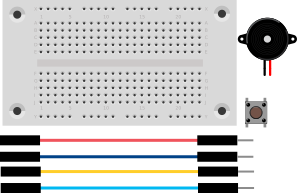
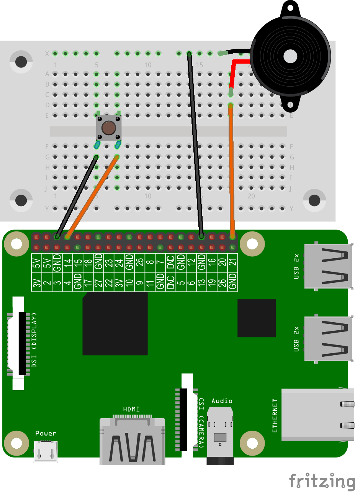
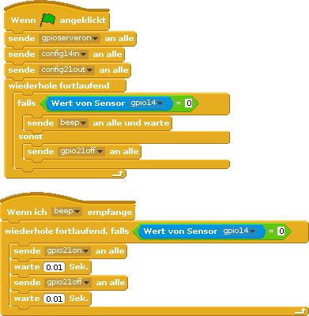

# Morsen
# Morsegerät bauen
## Material
* 1x Steckbrett
* 1x Buzzer
* 1x Taster
* 4x Kabel


<div style="page-break-after: always;"></div>
## Aufbau
Wir erweitern die Schaltung aus dem Schritt "Taster auslesen" um einen Buzzer. Bitte beachte, dass du den Buzzer richtig anschließt. Stecke den Pin mit "-" in die obere Leiste auf deinem Breadboard. In der Zeichnung ist dieser Pin schwarz markiert.




>**Scratch**: `morsen.sb` in deinem Projekt-Ordner für Scratch.
>
>**Python**: `morsen.py` in deinem Projekt-Ordner für Python.
<div style="page-break-after: always;"></div>
## Scratch-Programm



Der Block **gpioserveron**  startet den notwendigen GPIO-Server, damit das Programm auf die GPIO-Pins zugreifen kann. Mit **config18in** wird der GPIO-Pin für den Taster als Eingang, mit **config21out** der GPIO-Pin 21für den Buzzer als Ausgang definiert. Eine fortlaufend wiederholende Schleife prüft, ob der Taster (**Wert von Sensor gpio18=0**) gedrückt wird. Wenn die Bedingung erfüllt ist, wird der Programmblock beep aufgerufen. Sonst schaltet **gpio21off** den Buzzer aus.
Wissen: Eine Buzzer (Piezo-Lautsprecher) kann technisch nur einen kurzen Ton abgeben und ist für das Morsen ungeeignet. Um das auszugleichen hab wir einen eigene Funktion, oder Programmblock erstellt. Der Programmblock schaltet in einer Endlosschleife den Buzzer für eine 1/100 Sekunde ein, schaltet den Buzzer wieder für 1/100 Sekunde wieder an.
Für das menschliche Ohr hört sich das nach einem Dauerton an. Damit ist das Summen jetzt so lange, wie der Taster gedrückt wird. Damit können beliebige Morse-Codes gesendet werden.
<div style="page-break-after: always;"></div>

## Python-Programm

```python
import RPi.GPIO as GPIO
GPIO.setmode(GPIO.BCM)
GPIO.setwarnings(False)
from time import sleep
TasterPin = 18
BuzzerPin = 21
GPIO.setup(BuzzerPin, GPIO.OUT)
GPIO.output(BuzzerPin, GPIO.LOW)
GPIO.setup(TasterPin, GPIO.IN, pull_up_down=GPIO.PUD_UP)
def beep():
        GPIO.output(BuzzerPin,GPIO.HIGH)
        sleep(0.01)
        GPIO.output(BuzzerPin,GPIO.LOW)
        sleep(0.01)
while True:
    if GPIO.input(TasterPin) == False:
        beep()
    else:
        GPIO.output(BuzzerPin,GPIO.LOW)
sleep(0.2)
```
<div style="page-break-after: always;"></div>

Buchstabe | Morse-Code
----------|-----------
A         | **· −**
B         | **− · · ·**
C         | **− · − ·**
D         | **− · ·**
E         | **·**
F         | **· · − ·**
G         | **− − ·**
H         | **· · · ·**
I         | **· ·**
J         | **· − − −**
K         | **− · −**
L         | **· − · ·**
M         | **− −**
N         | **− ·**
O         | **− − −**
P         | **· − − ·**
Q         | **− − · −**
R         | **· − ·**
S         | **· · ·**
T         | **−**
U         | **· · −**
V         | **· · · −**
W         | **· − −**
X         | **− · · −**
Y         | **− · − −**
Z         | **− − · ·**
{: class="table table-striped table-hover"}

Zahl   | Morse-Code
-------|-----------
1      | **· − − − −**
2      | **· · − − −**
3      | **· · · − −**
4      | **· · · · −**
5      | **· · · · ·**
6      | **− · · · ·**
7      | **− − · · ·**
8      | **− − − · ·**
9      | **− − − − ·**
0      | **− − − − −**
{: class="table table-striped table-hover"}

<div style="page-break-after: always;"></div>
<div style="page-break-inside: avoid;">

## Text in Morse-Code übersetzen

```
morseAlphabet = {
"A" : ".-",
"B" : "-...",
"C" : "-.-.",
"D" : "-..",
"E" : ".",
"F" : "..-.",
"G" : "--.",
"H" : "....",
"I" : "..",
"J" : ".---",
"K" : "-.-",
"L" : ".-..",
"M" : "--",
"N" : "-.",
"O" : "---",
"P" : ".--.",
"Q" : "--.-",
"R" : ".-.",
"S" : "...",
"T" : "-",
"U" : "..-",
"V" : "...-",
"W" : ".--",
"X" : "-..-",
"Y" : "-.--",
"Z" : "--..",
" " : " ",
"1" : ".----",
"2" : "..---",
"3" : "...--",
"4" : "....-",
"5" : ".....",
"6" : "-....",
"7" : "--...",
"8" : "---..",
"9" : "----.",
"0" : "-----",
"." : ".-.-.-",
"," : "--..--",
":" : "---...",
"?" : "..--..",
"'" : ".----.",
"-" : "-....-",
"/" : "-..-.",
"@" : ".--.-.",
"=" : "-...-"
}

msg = raw_input('Nachricht: ')

for char in msg:
 print (morseAlphabet[char.upper()]),
```

**Python:** `texteingabe -in-morsecode.py` in deinem Projekt-Ordner für Python. Bitte beachten: das Beispiel funktioniert nur mit Python2
</div>
