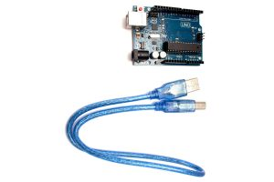
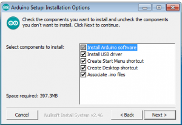
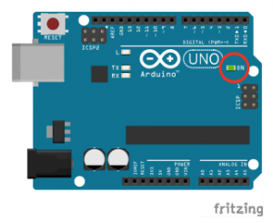
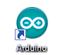
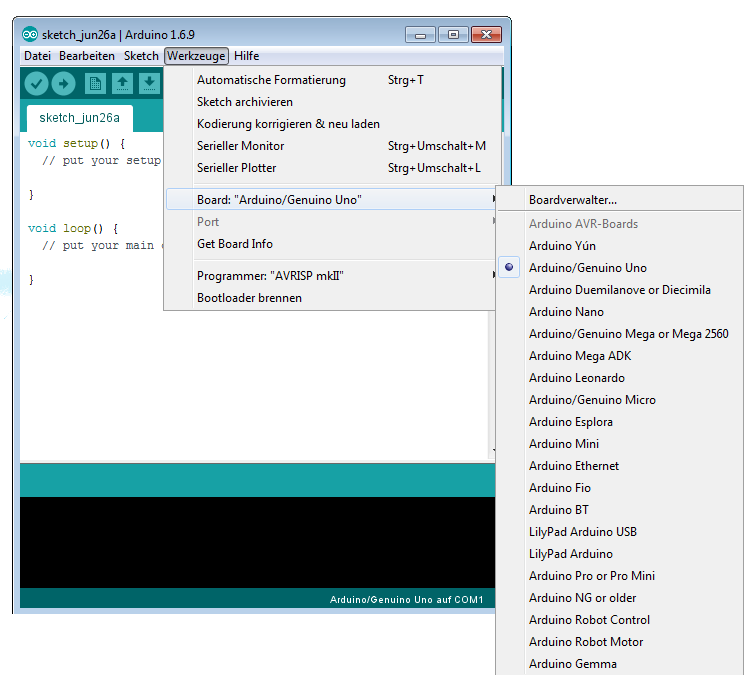
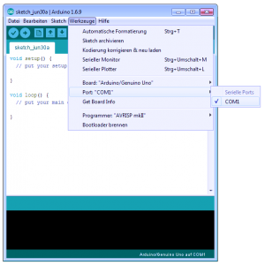
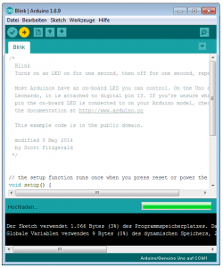
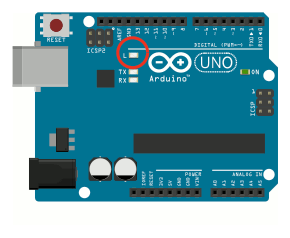

# Arduino-Setup auf einem Windows-PC

Die Anleitung erklärt, wie du das Arduino-Board an den Computer anschließt.

## Du benötigst den Arduino und ein USB-Kabel

## Herunterladen und Installieren der Arduino Software

Lade die neueste Version der Entwicklungsumgebung von der [Download –
Seite](https://www.arduino.cc/en/Main/Software) herunter. Wir empfehlen
dir die .exe, die direkt alles installiert. Die benötigen die Arduino
Software und einschließlich der passenden Treiber.

## Den Arduino mit dem Computer verbinden

Die USB-Verbindung mit dem PC ist notwendig, um die Karte zu programmieren & mit Strom zu versorgen.

Wenn der Arduino mit dem Computer verbunden ist, dann leuchtet die
Power-LED auf dem Arduino.

## Kartentreiber werden automatisch installiert

Bei Windows – von XP bis zu 10 – installieren sich die Treiber
automatisch, sobald der Arduino zum ersten mal am Computer angeschlossen
wird. Bitte warte die Installationsprozess ab und mach erst dann weiter.

## Starte die Arduino Software

Starte die Sofware mit einem Doppelklick auf das Symbol auf dem Desktop.

## Wähle das Board

Für die Übertragung muss zunächst der angeschlossenen Arduino ausgewählt
werden. Hierzu unter Tools -\> Board das verwendete Board auswählen.
(z.B. Arduino UNO)\
 Board auswählen. Der Boardname steht auf der Platine

## Wähle die Schnittstelle

Anschließend sucht ihr den Port, an dem der Arduino angeschlossen ist
aus.

## Erster Versuch mit dem Blink Beispiel

Öffne das LED – Blink Beispiel über Datei\> Beispiele\> 01.Basics\>
Blink.

Jetzt kann das Programm in ein maschinenlesbares Format übersetzt und an
den Arduino übertragen werden. Hierzu drücke wir einfach auf Upload.

Nach ein paar Sekunden sollten die LED auf dem Arduino-Board beginnen zu
blinken. Der Prozess kann im Bereich Statusmeldungen überprüft werden.
Wenn etwas nicht funktioniert, reicht es in der Regel, wenn man die
Fehlermeldung bei Google sucht. Irgendjemand hatte bestimmt schon mal
das gleiche Problem.

