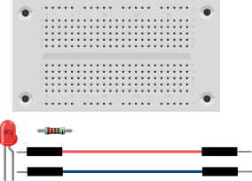

# LED mit einem Programm schalten
## Material
* 1x LED
* 1x 220 Ohm Widerstand
* 2x Kabel
* 1x Steckbrett



<div style="page-break-after: always;"></div>

## Aufbau


>**Programm-Beispiel**: `led.ino`

<div style="page-break-after: always;"></div>

Nach der Installation der Entwicklungsumgebung aus dem [**Kapitel Vorbereitung**](/arduino-scoutlab-session-kit-1/vorbereitung) könnt ihr das Programm öffnen und das Programm-Beispiel in den Editor kopieren.

## Quell-Code

```c++
const int LED_Pin = 13;

void setup()
{
pinMode(LED_Pin, OUTPUT);
}

// the loop function runs over and over again forever
void loop() {
  digitalWrite(LED_Pin, HIGH);   // turn the LED on (HIGH is the voltage level)
  delay(1000);                       // wait for a second
  digitalWrite(LED_Pin, LOW);    // turn the LED off by making the voltage LOW
  delay(1000);                       // wait for a second
}
```
Jetzt kann das Programm in ein maschinenlesbares Format übersetzt und an den Arduino übertragen werden. Hierzu drücke wir einfach auf Upload.


Upload Code. Unten kann man überprüfen, ob die Übertragung funktioniert.

Nach ein paar Sekunden sollte die LED beginnen zu blinken. Der Prozess kann im Bereich Statusmeldungen überprüft werden. Wenn etwas nicht funktioniert, reicht es in der Regel, wenn man die Fehlermeldung bei Google sucht. Irgendjemand hatte bestimmt schon mal das gleiche Problem.
