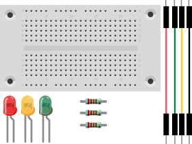
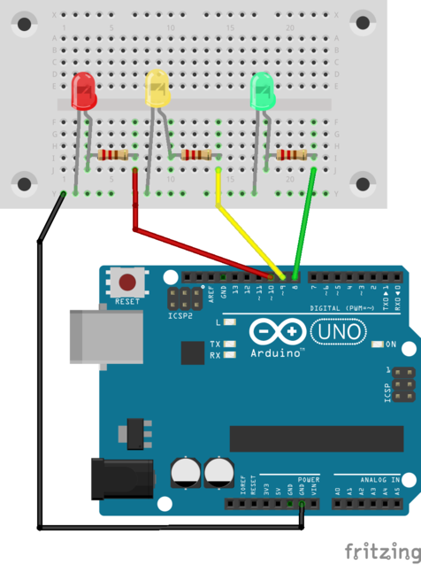

# Ampel
## Material
* 1x LED rot
* 1x LED gelb
* 1x LED grün
* 3x 220 Ohm Widerstand
* 4x Kabel
* 1x Steckbrett



<div style="page-break-after: always;"></div>

## Aufbau



>**Programm-Beispiel**: `ampel.ino`

<div style="page-break-after: always;"></div>


## Programm

```c
const int rot = 10;
const int gelb = 9;
const int gruen = 8;

void setup() {
  pinMode(rot, OUTPUT);
  pinMode(gelb, OUTPUT);
  pinMode(gruen, OUTPUT);
}

void loop() {
digitalWrite(rot, HIGH);
delay(2000);
digitalWrite(gelb, HIGH);
delay(1500);
digitalWrite(gruen, HIGH);
digitalWrite(rot, LOW);
digitalWrite(gelb, LOW);
delay(2000);
digitalWrite(gruen, LOW);
digitalWrite(gelb, HIGH);
delay(2000);
digitalWrite(gelb, LOW);
}
```
