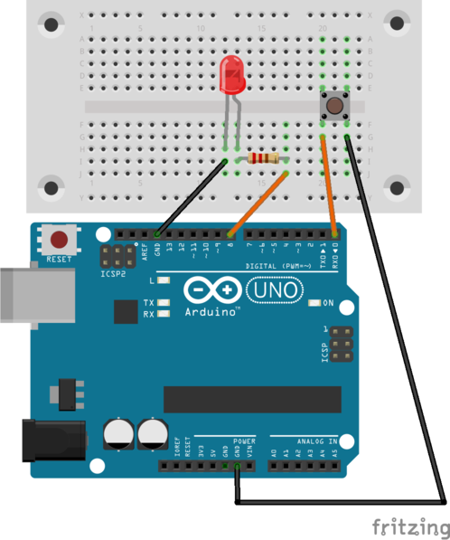

# LED mit einem Taster schalten

## Material
* 1x LED
* 1x 220 Ohm Widerstand
* 1x Taster
* 4x Kabel
* 1x Steckbrett


<div style="page-break-after: always;"></div>
## Aufbau

Wir erweitern die Schaltung aus dem Schritt "Taster auslesen" um eine LED und einen Schutzwiderstand.




>**Programm-Beispiel**: `taster_led.ino`


## Quell-Code

```c

const int TasterPin = 0;
const int LED_Pin = 8;

void setup() {
  // put your setup code here, to run once:
pinMode(LED_Pin, OUTPUT);
// Anschluss als Eingang definieren und Pull Up Widerstand aktivieren
pinMode(TasterPin, INPUT_PULLUP);
}

void loop() {
  // put your main code here, to run repeatedly:
if (digitalRead(TasterPin)==LOW)
{
digitalWrite(LED_Pin, HIGH);
}
else
{
digitalWrite(LED_Pin, LOW);
}
}
```

Die GPIO-Pins sind internen mit Pull-up- und Pull-down-Widerständen versehen. Das vereinfacht z. B. den Anschluss von Tastern. Wenn du den Pull-up-oder Pull-down-Widerstand an einem GPIO-Pin nutzen möchtest, dann musst im setup, wie im folgenden Beispiel, einen dritten Parameter mit angeben:

```C
pinMode(TasterPin, INPUT_PULLUP);
```
