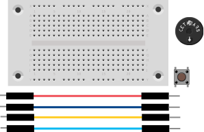
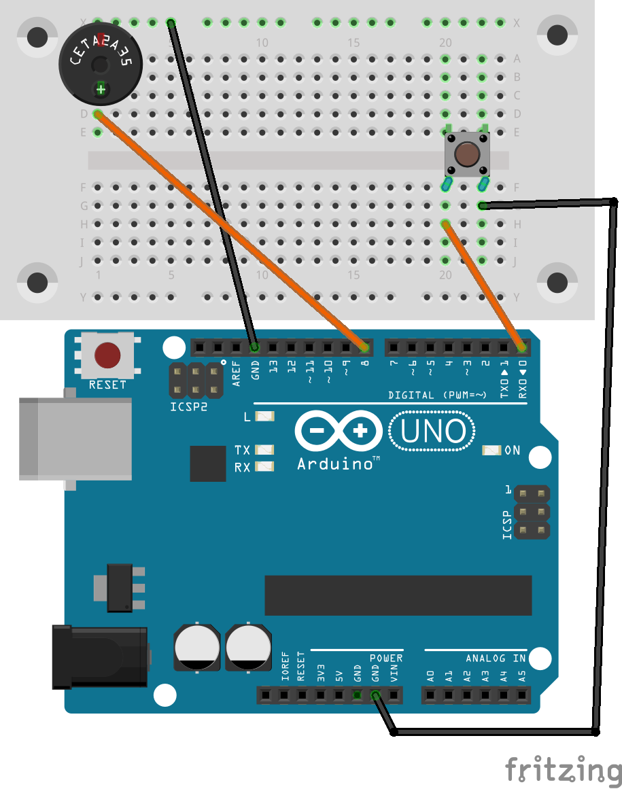

# Morsen
# Morsegerät bauen
## Material
* 1x Steckbrett
* 1x Buzzer
* 1x Taster
* 4x Kabel



<div style="page-break-after: always;"></div>
## Aufbau
Wir ersetzen in der Schaltung aus dem Schritt "LED mit einem Taster schalten" die LED um einen Buzzer. Bitte beachte, dass du den Buzzer richtig anschließt. Stecke den Pin mit "-" in die obere Leiste auf deinem Breadboard. In der Zeichnung ist dieser Pin schwarz markiert.




>**Programm-Beispiel**: `morsen.ino`

<div style="page-break-after: always;"></div>

## Quell-Code

```c

const int TasterPin = 0;
const int Buzzer_Pin = 8;

void setup() {
  // put your setup code here, to run once:
pinMode(Buzzer_Pin, OUTPUT);
pinMode(TasterPin, INPUT_PULLUP);
// Anschluss als Eingang definieren und Pull Up Widerstand aktivieren
}

void loop() {
  // put your main code here, to run repeatedly:
if (digitalRead(TasterPin)==LOW)
{
tone(Buzzer_Pin, 200);
delay (100); // Warten mit einer kurzen Dauer
noTone(Buzzer_Pin); // Ausschalten des Tons.
}
else
{
noTone(Buzzer_Pin);
}
}
```


Buchstabe | Morse-Code
----------|-----------
A         | **· −**
B         | **− · · ·**
C         | **− · − ·**
D         | **− · ·**
E         | **·**
F         | **· · − ·**
G         | **− − ·**
H         | **· · · ·**
I         | **· ·**
J         | **· − − −**
K         | **− · −**
L         | **· − · ·**
M         | **− −**
N         | **− ·**
O         | **− − −**
P         | **· − − ·**
Q         | **− − · −**
R         | **· − ·**
S         | **· · ·**
T         | **−**
U         | **· · −**
V         | **· · · −**
W         | **· − −**
X         | **− · · −**
Y         | **− · − −**
Z         | **− − · ·**
{: class="table table-striped table-hover"}


Zahl   | Morse-Code
-------|-----------
1      | **· − − − −**
2      | **· · − − −**
3      | **· · · − −**
4      | **· · · · −**
5      | **· · · · ·**
6      | **− · · · ·**
7      | **− − · · ·**
8      | **− − − · ·**
9      | **− − − − ·**
0      | **− − − − −**
{: class="table table-striped table-hover"}
