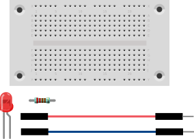
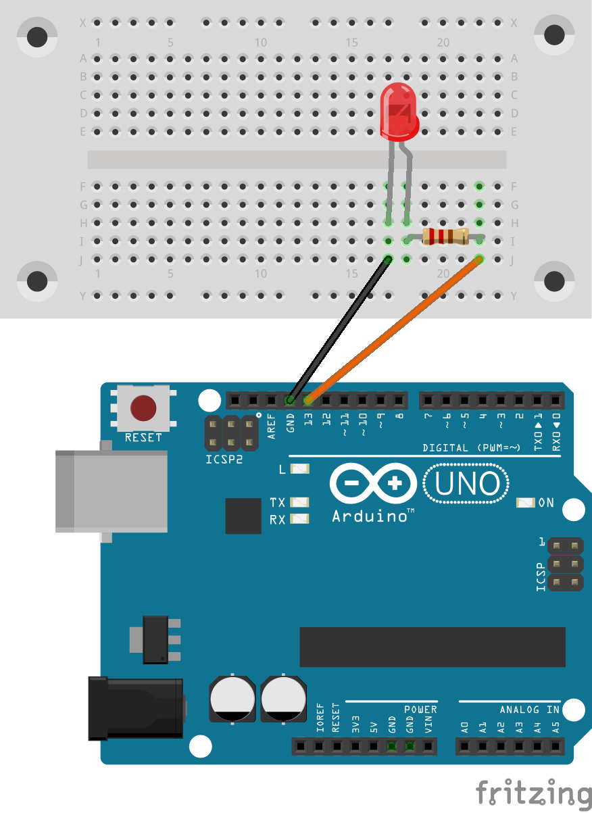

# LED mittels Zufallszahl steuern
## Material
* 1x LED
* 1x 220 Ohm Widerstand
* 2x Kabel
* 1x Steckbrett



<div style="page-break-after: always;"></div>
## Aufbau




>**Programm-Beispiel**: `led_zufall.ino`

<div style="page-break-after: always;"></div>

Nun wollen wir das Arbeitsblatt „LED mit einem Programm schalten“ etwas interessanter gestalten.
In beiden Blöcken werden „warte 2 Sek.“ durch den neuen Block ersetzt. Ziehe einfach den Block in das Feld mit der „2“. Jetzt lässt das Programm die LED zufällig lang (zwischen 1 und 5 Sekunden) leuchten. Auch die Pause, während die LED nicht leuchtet, ist ebenfalls zufällig lang (zwischen 1 und 5 Sekunden).


## Quell-Code
```c
const int LED_Pin = 13;

void setup()
{
pinMode(LED_Pin, OUTPUT);
}

// the loop function runs over and over again forever
void loop() {
  digitalWrite(LED_Pin, HIGH);   // turn the LED on (HIGH is the voltage level)
  delay(random(1000,5000));                       // random wait between a second and five seconds
  digitalWrite(LED_Pin, LOW);    // turn the LED off by making the voltage LOW
  delay(random(1000,5000));                       // random wait between a second and five seconds
}
```
