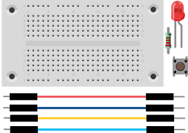
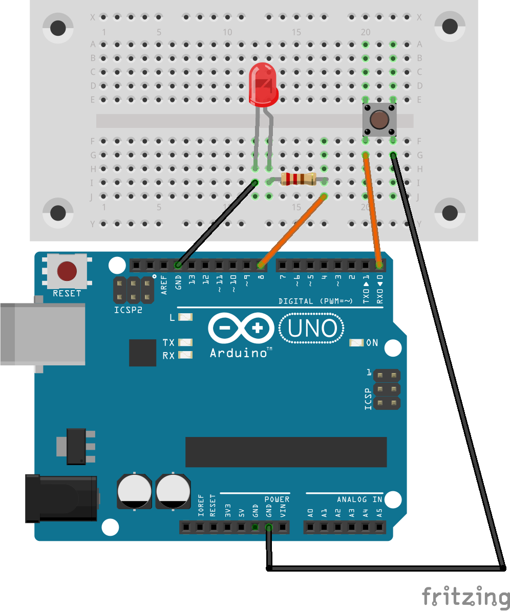

# Computerspiel Schnelligkeit
## Material
* 1x LED
* 1x 220 Ohm Widerstand
* 1x Taster
* 4x Kabel
* 1x Steckbrett


<div style="page-break-after: always;"></div>

## Aufbau
Wir verwenden die Schaltung aus dem Schritt „LED mit einem Taster schalten“ für das Computerspiel Schnelligkeit.




>**Programm-Beispiel**: `led_spiel.ino`

<div style="page-break-after: always;"></div>

## Quell-Code
```c

const int TasterPin = 0;
const int LED_Pin = 8;
float zeit;

void setup() {
  // put your setup code here, to run once:
  Serial.begin(9600);      // open the serial port at 9600 bps:    
pinMode(LED_Pin, OUTPUT);
// Anschluss als Eingang definieren und Pull Up Widerstand aktivieren
pinMode(TasterPin, INPUT_PULLUP);
  digitalWrite(LED_Pin, HIGH);
  delay(random(1000,5000));                       // random wait between a second and five seconds
  digitalWrite(LED_Pin, LOW);    // turn the LED off by making the voltage LOW
}

void loop() {
  // put your main code here, to run repeatedly:
if (digitalRead(TasterPin)==LOW)
{
//print("Ergebnis %.2f Sekunden." % (zeit))
Serial.println ("Ergebnis:");
Serial.println (zeit);
Serial.println ("Sekunden");
  Serial.end();
}
else
{
zeit = zeit + 0.1; //Zeit läuft weiter
delay(100);
}
}
```
