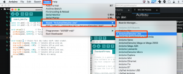
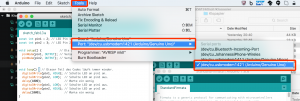
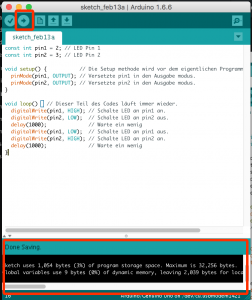

# Arduino-Setup auf einem Mac

Die Anleitung erklärt, wie du das Arduino-Board an den Computer anschließt.

## Du benötigst den Arduino und ein USB-Kabel

## Herunterladen und Installieren der Arduino Software

Lade die neueste Version von der [Download – Seite](https://www.arduino.cc/en/Main/Software).
 Wenn der Download abgeschlossen ist, mach einen Doppelklick auf die zip-Datei.
 Damit wird die Datei entpackt.

Um die Arduino-Software zu Installieren kopiere die Arduino-Anwendung in den Programme-Ordner.

## Den Arduino mit dem Computer verbinden

Die USB-Verbindung mit dem PC ist notwendig, um die Karte zu programmieren & mit Strom zu versorgen.

Wenn der Arduino mit dem Computer verbunden ist, dann leuchtet die Power-LED auf dem Arduino.

## Wähle das Board

Für die Übertragung muss zunächst der angeschlossenen Arduino ausgewählt werden. Hierzu unter Tools -\> Board das verwendete Board auswählen. (z.B. Arduino UNO)
 Board auswählen. Der Boardname steht auf der Platine

## Wähle die Schnittstelle

Anschließend sucht ihr den Port, an dem der Arduino angeschlossen ist aus.

## Erster Versuch mit dem Blink Beispiel

Öffne das LED – Blink Beispiel über Datei\> Beispiele\> 01.Basics\> Blink.

Jetzt kann das Programm in ein maschinenlesbares Format übersetzt und an den Arduino übertragen werden. Hierzu drücke wir einfach auf Upload.

Nach ein paar Sekunden sollten die LED auf dem Arduino-Board beginnen zu blinken. Der Prozess kann im Bereich Statusmeldungen überprüft werden. Wenn etwas nicht funktioniert, reicht es in der Regel, wenn man die Fehlermeldung bei Google sucht. Irgendjemand hatte bestimmt schon mal das gleiche Problem.

