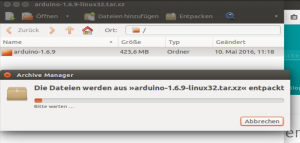
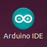
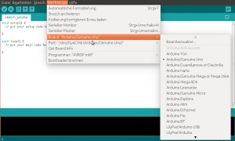
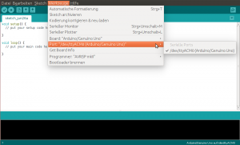
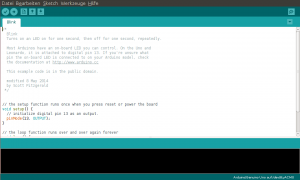
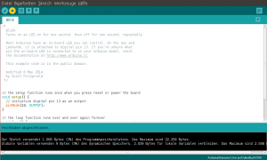

# Arduino-Setup auf einem Linux-PC

Die Anleitung erklärt, wie du das Arduino-Board an den Computer anschließt.

## Du benötigst den Arduino und ein USB-Kabel

## Herunterladen und Entpacken der Arduino Software

Lade die neueste Version von der [Download – Seite](https://www.arduino.cc/en/Main/Software). Wähle das 32- oder 64 – Bit – Paket passend zu deiner Linux – Version. Wenn der Download abgeschlossen ist, entpacke das Arduino tar.xz Paket in einen Ordner, in dem die Arduino Software später ausgeführt werden soll.

## Installieren der Software

Ruf die Konsole auf und wechsle in den gerade angelegten Arduino-Ordner und starte die install.sh – Datei.
 Der Installationsprozess wird relativ schnell ausgeführt. Nach Abschluss erscheint das Arduino-Icon auf dem Desktop.

Damit später die Arduino-Software auch den USB-Port nutzen darf musst du noch folgenden Befehl im Terminal ausführen (ersetze dabei \<username\> durch deinen Benutzernamen):

`sudo usermod -a -G dialout <username>`

z.B. dein Benutzername ist „scoutlab“, dann lautet der passende Befehl:

`sudo usermod -a -G dialout scoutlab`

Damit die Änderung aktiv wird, melde dich komplett am System ab und direkt wieder an. Sonst wird die Änderung nicht aktiv und die weiteren Schritte können nicht ausgeführt werden.

## Den Arduino mit dem Computer verbinden

Die USB-Verbindung mit dem PC ist notwendig, um die Karte zu programmieren & mit Strom zu versorgen.

Wenn der Arduino mit dem Computer verbunden ist, dann leuchtet die Power-LED auf dem Arduino.

## Starte die Arduino Software

Starte die Software mit einem Doppelklick auf das Symbol auf dem Desktop.

## Wähle das Board

Für die Übertragung muss zunächst der angeschlossenen Arduino ausgewählt werden. Hierzu unter Tools -\> Board das verwendete Board auswählen. (z.B. Arduino UNO)
 Board auswählen. Der Boardname steht auf der Platine

## Wähle die Schnittstelle

Anschließend sucht ihr den Port, an dem der Arduino angeschlossen ist aus.

## Erster Versuch mit dem Blink Beispiel

Öffne das LED – Blink Beispiel über Datei\> Beispiele\> 01.Basics\> Blink.

Jetzt kann das Programm in ein maschinenlesbares Format übersetzt und an den Arduino übertragen werden. Hierzu drücke wir einfach auf Upload.

Nach ein paar Sekunden sollten die LED auf dem Arduino-Board beginnen zu blinken. Der Prozess kann im Bereich Statusmeldungen überprüft werden. Wenn etwas nicht funktioniert, reicht es in der Regel, wenn man die Fehlermeldung bei Google sucht. Irgendjemand hatte bestimmt schon mal das gleiche Problem.

