# Bristlebot
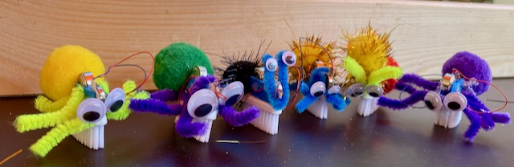

[Bristlebot](https://en.wikipedia.org/wiki/Bristlebot) Sind kleine sehr einfach konstruierte "Roboter". Sie lassen sich schon in der Wölflingsstufe bauen und bieten somit einen ersten Zugang zum Experimentieren mit Technologie. Durch ihren simplen Aufbau und die geringen Kosten bieten sie sich auch gut als mitmache Angebot auf Gemeindefesten etc. an.

## Material & Werkzeug

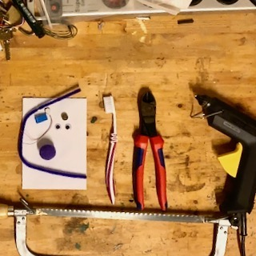

Material:

- Zahnbürste
- Knopfzelle LR44 1,5V
- Handy-Vibrationsmotor (1,5V, 10 x 2,7mm)
- 3D-Druck Teil ([STL-Datei](downloads/bot.stl))
- Dekomaterial (Pompons, Pfeifenreiniger, Wackelaugen, ...)

 Das 3-D-Druck-Teil könnt ihr selber ausdrucken oder über den Materialversand bestellen. Man kann es auch weglassen. Dann kann man aber nicht einfach die Batterie tauschen.

Werkzeug:

- Metallsäge
- Heißkleber
- Schere oder Zange

## Aufbau

1. Zahnbürstenkopf absägen. Der Stiel kann weggeschmissen werden.
2. Eine kleine Menge Heißkleber auf den Zahnbürstenkopf geben.
3. Das Plastikteil aus dem 3-D-Druck aufkleben.
4. Den Motor in den passenden Schlitz stecken.
5. Kabel abisolieren und nur die blanken Enden links und rechts in die passenden Löcher stecken.
6. Batterie einsetzen. Dabei den Roboter festhalten, damit er nicht losläuft.
7. Drähte mit Heißkleber fixieren und Batterie wieder entnehmen.
8. Roboter dekorieren.
9. Fertig

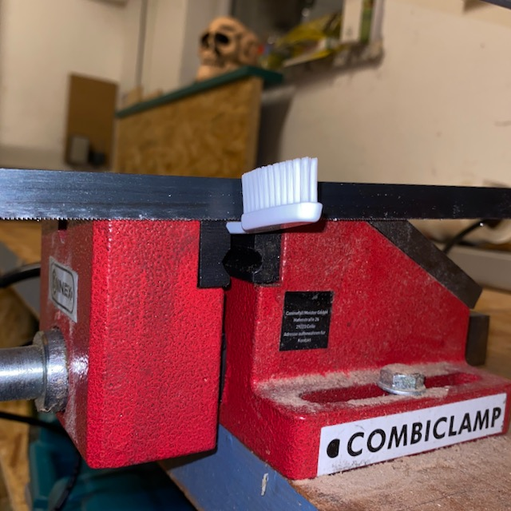
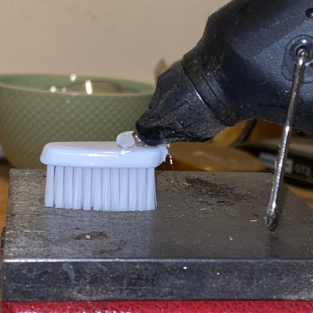
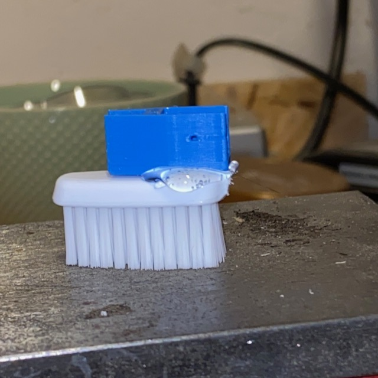
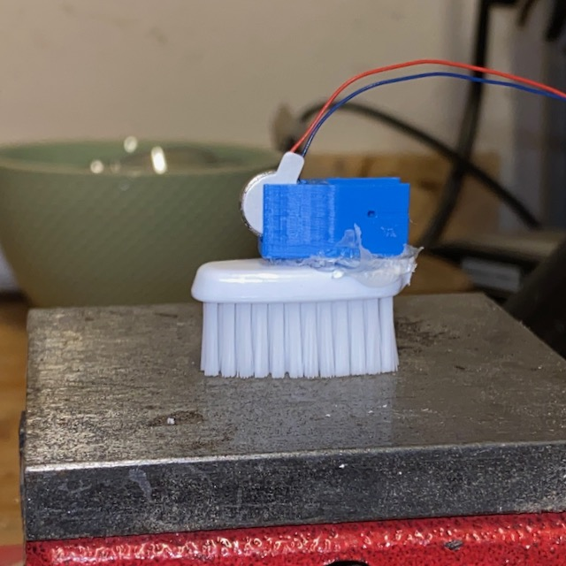
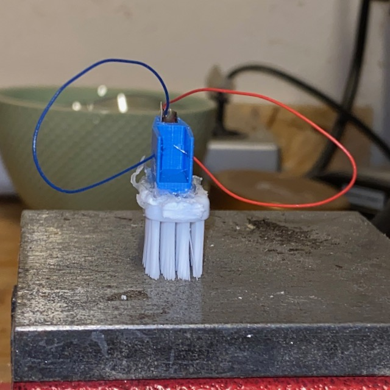
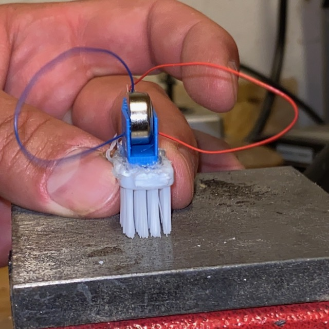
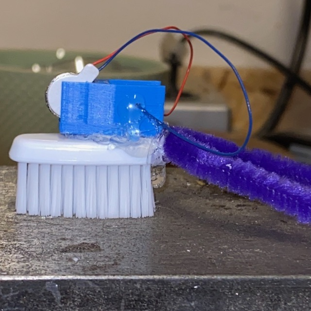
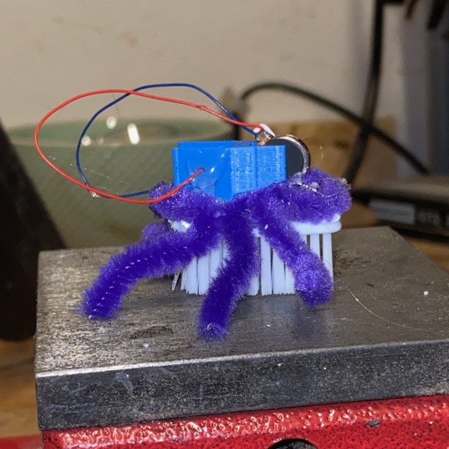
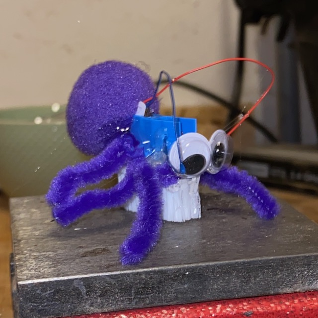

Der Roboter ist jetzt fertig. Um ihn zu starten, einfach die Batterie einlegen. Damit der Roboter geradeaus fährt, die Borsten der Zahnbürste zum Beispiel auf die Tischplatte in Fahrtrichtung drücken. Wenn der Roboter nur Kreise fährt, kann es hilfreich sein, dass Gewicht etwas auszugleichen.

## Spielideen

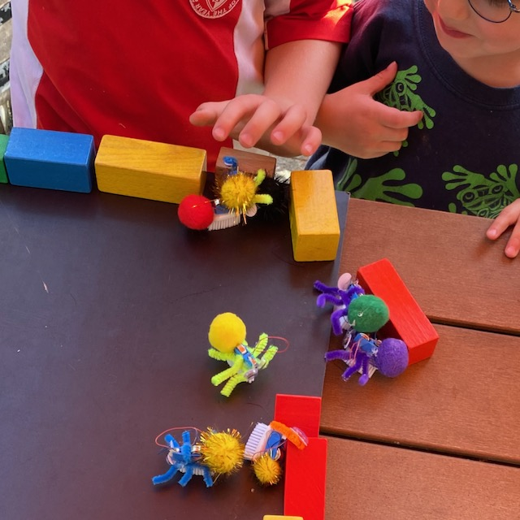

Die kleinen Bristlebots sind nicht kräftig. Alles, was sie benötigen, ist eine glatte Oberfläche. Damit sie nicht vom Tisch fallen, können Begrenzungen und Parcours mit Bauklötzen aufgebaut werden.

- Arena: Eine große Fläche, auf der die Bots durch die Gegend sausen können. Grade bei kleinen Kindern (3-6 Jahre) regt das Verhalten der Bots die Fantasie an und es werden schnell kleine Geschichten rund um das Geschehen entwickelt.
- Sumo: Ein Kreis in der Mitte. Die Bots dürfen den Kreis nicht verlassen und nicht umkippen.
- Rennen: Die Bots treten gegeneinander in einem Parcours aus Bauklötzen an. Der Schnellste gewinnt. Dabei gibt es unterschiedliche Varianten. Mit abgetrennten Fahrspuren oder einem gemeinsamen Rundkurs.

## Weiterführende Informationen

- [Wunderwuzzi.at](https://www.wunderwuzzi.at/)
