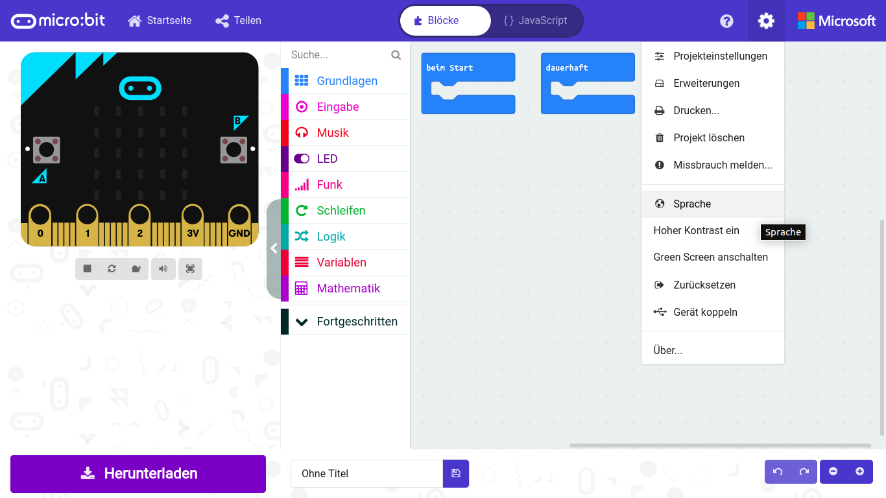
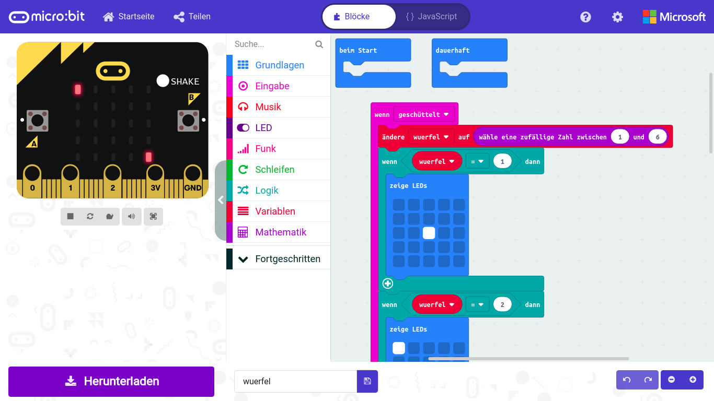
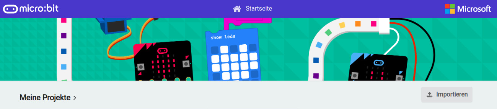

## Den micro:bit vorbereiten

Um den micro:bit in Betrieb zu nehmen, braucht man:
+ PC mit Windows 10, 8.1, 7 (Mac OSX oder Linux)
+ MicroUSB-Kabel

Die Verbindung zwischen PC und micro:bit erfolgt über ein MicroUSB-Kabel. Das Kabel wird gleichzeitig zur Stromversorgung wie auch zur Datenübertragung verwendet. Schließe den micro:bit mit einem USB-Kabel an einem freien USB-Anschluss des PCs an. Beim ersten Mal wird automatisch ein Treiber installiert, damit der micro:bit in Zukunft als Laufwerk im Windows Explorer erscheint.

Nachdem der Treiber installiert ist, finden Sie den micro:bit im Windows Explorer bei den Laufwerken mit dem Namen MICROBIT und einem bisher nicht verwendeten Laufwerksbuchstaben. Der micro:bit ist aber trotzdem kein normales Laufwerk. Es kann immer nur eine Programmdatei darauf abgelegt werden. Sie ist im Windows Explorer auf dem Laufwerk nicht zu sehen. Auch das Speichern anderer Dateitypen ist nicht möglich.

## Der Makecode-Editor
Für die Programme verwenden wir die Programmierplattform Makecode von Microsoft – [https://makecode.microbit.org/](https://makecode.microbit.org/)

In Makecode braucht man beim Programmieren keinen Programmcode zu tippen. Die Blöcke werden einfach per Drag and Drop aneinander gehängt. Der Makecode-Editor läuft im Browser. Es braucht kein Programm installiert zu werden.

Klicke oben rechts auf das Einstellungen-Symbol, wähle im Menü Language und dann die Sprache Deutsch.

### Der Makecode-Editor

Für die Programme verwenden wir die Programmierplattform Makecode von Microsoft – [https://makecode.microbit.org/](https://makecode.microbit.org/). In Makecode braucht man beim Programmieren keinen Programm- code zu tippen. Die Blöcke werden einfach per Drag and Drop aneinander gehängt. Der Makecode-Editor läuft im Browser. Es braucht kein Programm installiert zu werden. Klicke oben rechts auf das Einstellungen-Symbol, wähle im Menü Klicken oben rechts auf das Einstellungen-Symbol, wähle im Menü Language und dann die Sprache Deutsch.

Links oben ist ein micro:bit abgebildet, der das Programm abspielt. Dieser Simulator zeigt jederzeit auch Änderungen im Programm sofort, ohne dass das Programm auf den "echten" micro:bit übertragen musst.

Das Quadrat-Symbol hält den Simulator an, das Dreieck startet ihn danach wieder. Im Makecode-Editor sind die verfügbaren Programmblöcke nach Gruppen geordnet. Ziehen Sie einen Block aus der Blockpalette in den Arbeitsbereich, erscheint er zunächst grau.

Erst Blöcke, die zusammen ein lauffähiges Programm ergeben, nehmen wieder ihre Grundfarbe an. Um einen Block zu löschen, ziehe ihn einfach wieder aus dem Arbeitsbereich auf die Blockpalette zurück. Die Blöcke sind so geformt, dass sie nur dann ineinander passen, wenn dies auch im Programm funktioniert. Dadurch können die gefürchteten Syntaxfehler nicht passieren, mit denen sich Programmierer alltäglich herumärgern müssen.

### Zwei Blöcke sind in jedem neuen Programm vorgegeben:

+ **beim Start** – alle Blöcke in dieser Klammer werden beim Start einmal ausgeführt. Ein Programm startet nach der Übertragung auf den micro:bit automatisch. Außerdem startet das Programm neu, wenn man den Taster auf der Rückseite drückt oder den Stromanschluss neu anschließt.
+ **dauerhaft** – Nachdem die Blöcke beim Start ausgeführt wurden, laufen die Programme in der Klammerdauerhaft als Endlosschleife, bis man den Stecker zieht.

<h2>Importieren der Programmbeispiele</h2>
Die verwendeten Programme. Entpacken Sie das Zip-Archiv in ein Verzeichnis auf Ihrer Festplatte.  Klicke auf der Startseite makecode.microbit.org auf Importieren, um ein Programm zu öffnen.
Du kannst die Programme aber auch einfach anhand der Abbildungen selbst zusammenbauen.

