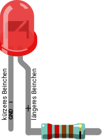
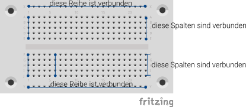
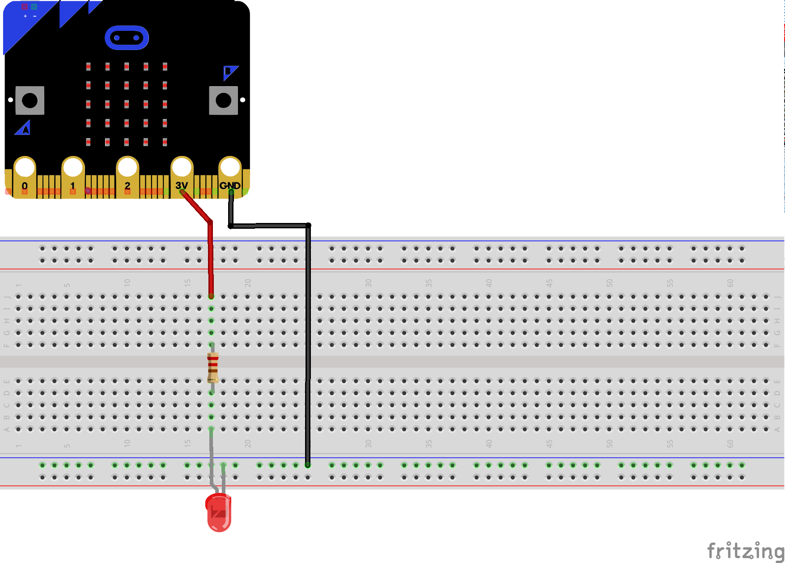

# LED leuchtet

Hinweis: Das benötigte Material ist im Scoutlab Session Kit enthalten. Das Kit muss vorher separat bestellt werden:
<a href="https://www.vcp.de/service/materialbestellung/#c288">https://www.vcp.de/service/materialbestellung/</a> 

## Material
+ mirco:bit
+ Steckbrett
+ 2 Krokodilklemmenkabel
+ 2 Steckbrückenkabel
+ LED
+ Widerstand 220 Ohm

## Editor:

[https://makecode.microbit.org/](https://makecode.microbit.org/)

<!--  -->

Wir nutzen den micro:bit als Stromquelle. Für dieses Experiment musst du nichts programmieren.

## Die LED (Leuchtdiode)
LED’s leuchten nur, wenn der Strom in die richtige Richtung fließt. Das kürzere Bein wird an den GND-Pin(-), das längere Bein wird an den jeweiligen Pin angeschlossen. Damit die LED nicht zu viel Strom bekommt und durchbrennt haben wir zwischen LED und Pin noch einen Widerstand geschaltet.

## Wie funktioniert das Steckbrett?
Eine Steckbrett (englisch breadboard) verwenden wir, um elektronische Bauteile miteinander zu verbinden. Die mechanische Befestigung der elektronischen Bauteilen ermöglicht uns Versuchsschaltungen.
Beim Steckbrett sind die Bauteile nicht gelötet, sondern in Federkontakte gesteckt. Dadurch kann die Schaltung durch einfaches Umstecken geändert werden.

Bei diesem Steckbrett sind die äußeren Längsreihen über Kontakte (X und Y) alle miteinander verbunden. In den anderen Kontaktreihen sind jeweils fünf Kontakte (A bis E und F bis J) quer miteinander verbunden, wobei in der Mitte des Steckbretts eine Lücke (Isolator) ist.

## Aufbau

Die LED wird mit dem Schutzwiderstand (am längeren Bein) am 3V - Pin angeschlossen. Das kürze Bein (GND) wird am GND-Pin angeschlossen. Wenn du alles richtig an geschlossen hast, leuchtet die LED.
