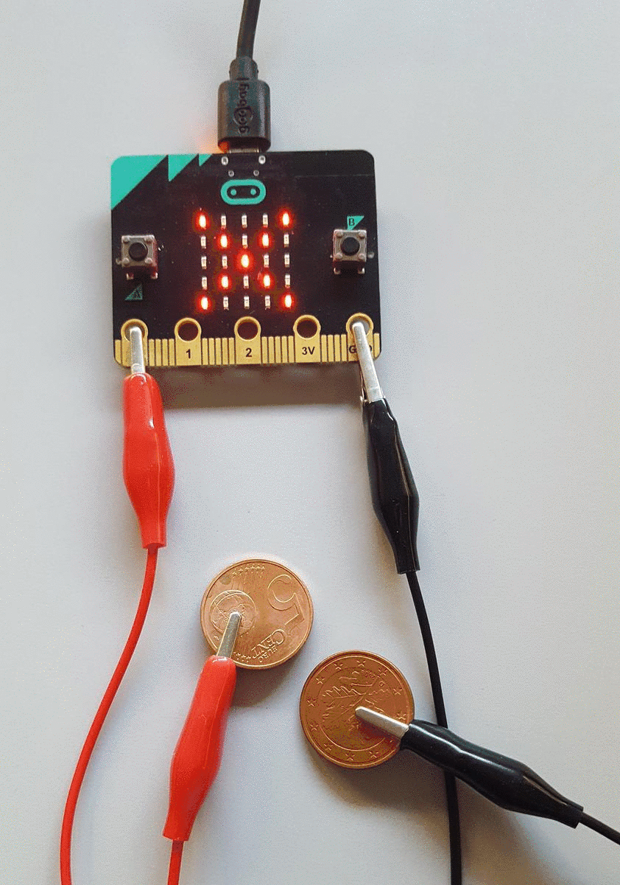
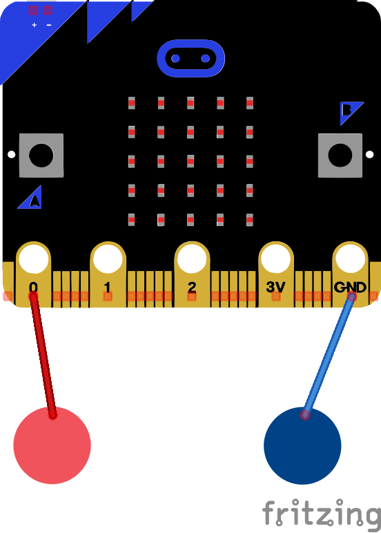
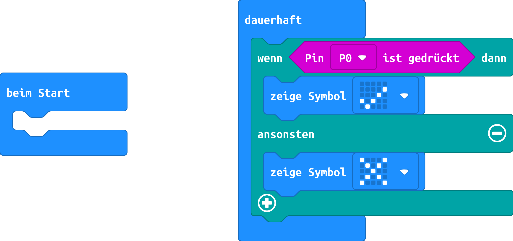

# Leitfähigkeit mit dem micro:bit prüfen

## Material
+ mirco:bit
+ 2 Krokodilklemmenkabel
+ 2 Münzen, 2 Metalllöffel oder zwei andere leitfähige
Gegenstände
## Editor

[https://makecode.microbit.org/](https://makecode.microbit.org/)

## Funktion

Klemme die erste Krokodilklemmenkabel am **Kontakt 0** des micro:bit und das zweite Krokodilklemmenkabel am **GND-
Kontakt** an. Klemme am anderen Enden Münzen, Metalllöffel oder andere leitfähige
Gegenstände an.

<b>Wichtig:</b> Nur durch das gleichzeitige Berühren der beiden Sensoren ist eine Reaktion des Programms sichergestellt.

Das Programm zeigt beim Berühren ein Häkchen auf der LED-Matrix an, beim Loslassen wird ein X-Symbol angezeigt.

## Schaltplan

## Programmbeispiel
[microbit-leitfaehigkeit.hex](appendix/microbit-leitfaehigkeit.hex)
