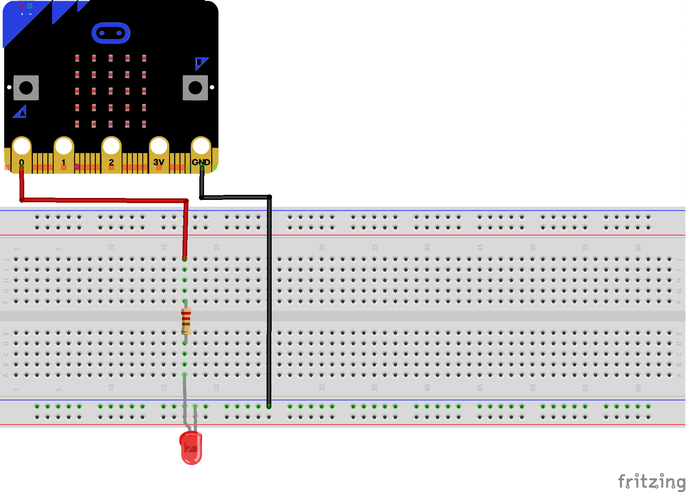
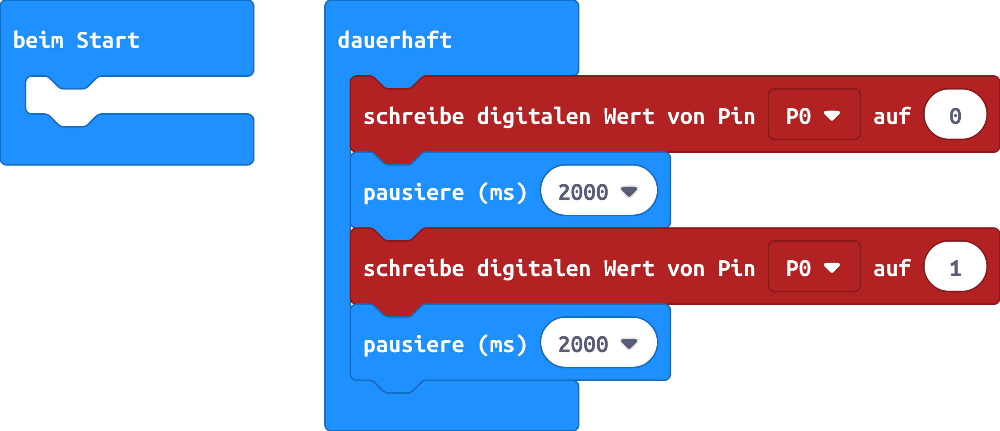

# LED mit einem Programm schalten
## Material
* 1x LED
* 1x 220 Ohm Widerstand
* 2x Kabel
* 1x Steckbrett

<!-- -->

## Material:

+ mirco:bit
+ Steckbrett
+ 2 Krokodilklemmenkabel
+ 2 Steckbrückenkabel
+ 1 LED
+ 1 Widerstände 220 Ohm

## Editor:

[https://makecode.microbit.org/](https://makecode.microbit.org/)

## Funktion:

Die LED wird endlos über ein Programm aus und wieder eingeschaltet.

## Schaltplan

## Code
[microbit-led.hex](appendix/microbit-led.hex)
