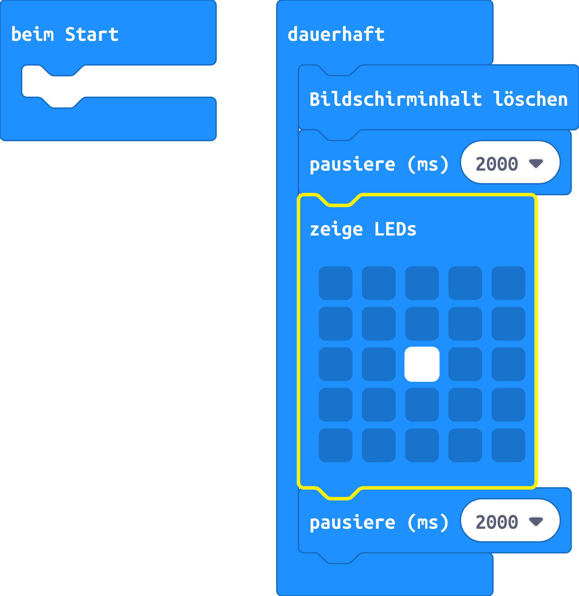

# LED mit einem Programm schalten

## Material:

+ mirco:bit

## Editor:

[https://makecode.microbit.org/](https://makecode.microbit.org/)

## Funktion:

Die LED wird über ein Programm aus und wieder eingeschaltet.

## Schaltplan

## Code
[microbit-led_ohne_kit.hex](appendix/microbit-led_ohne_kit.hex)
