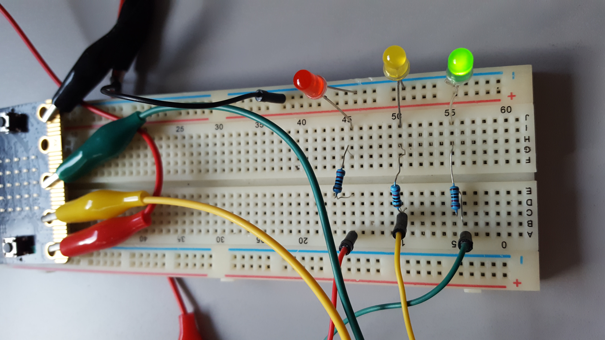
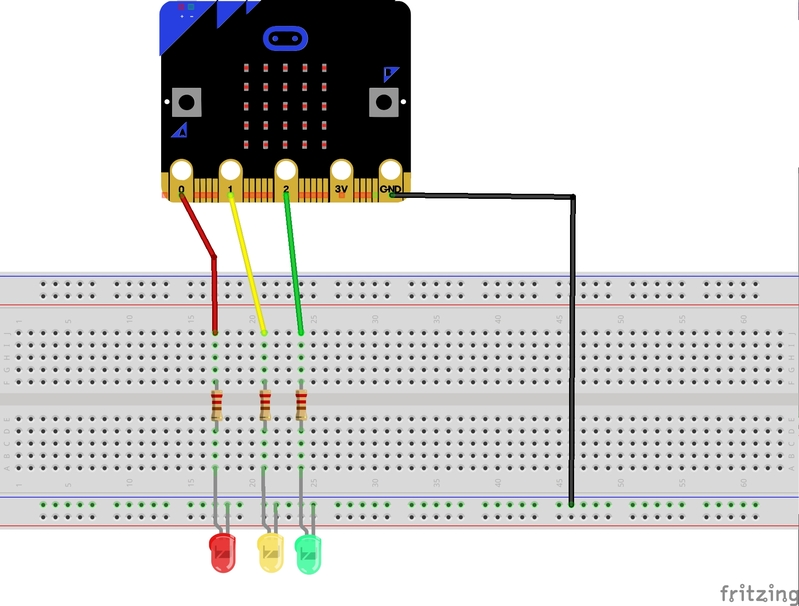
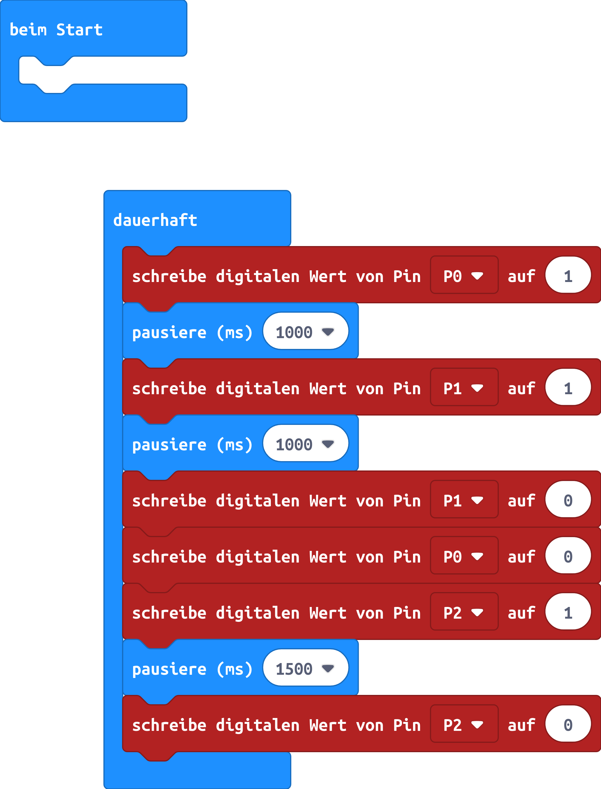

# Ampel

Hinweis: Das benötigte Material ist im Scoutlab Session Kit enthalten. Das Kit muss vorher separat bestellt werden:   
[https://www.vcp.de/service/materialbestellung/](https://www.vcp.de/service/materialbestellung/#c288)

## Material:

+ mirco:bit
+ Steckbrett
+ 4 Krokodilklemmenkabel
+ 4 Steckbrückenkabel
+ 3 LEDs
+ 3 Widerstände je 220 Ohm

## Editor:

[https://makecode.microbit.org/](https://makecode.microbit.org/)

## Funktion:

Eine Ampelschaltung über die LEDs wird umgesetzt.

## Schaltplan

## Code
[microbit-ampel.hex](appendix/microbit-ampel.hex)
