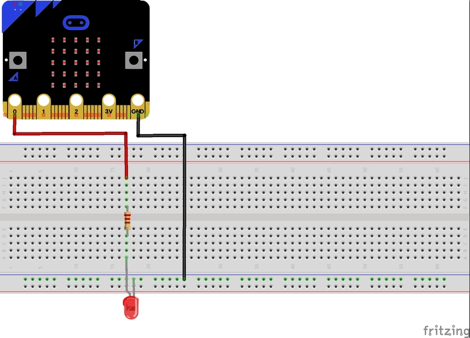
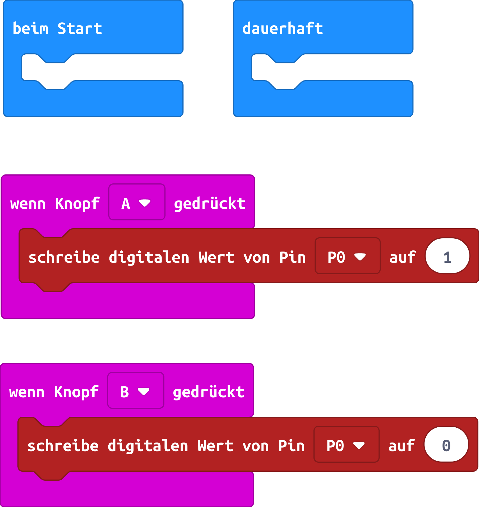

# LED mit Tastern ein- und ausschalten mit dem micro:bit

Hinweis: Das benötigte Material ist im Scoutlab Session Kit enthalten. Das Kit muss vorher separat bestellt werden:
<a href="https://www.vcp.de/service/materialbestellung/#c288">https://www.vcp.de/service/materialbestellung/</a>

## Material:

+ mirco:bit
+ Steckbrett
+ 2 Krokodilklemmenkabel
+ 2 Steckbrückenkabel
+ LED
+ Widerstand 220 Ohm

## Editor:

[https://makecode.microbit.org/](https://makecode.microbit.org/)

## Funktion:

Mit dem Taster A wird die LED eingeschaltet. Mit dem Taster B wird die LED wieder ausgeschaltet.

## Schaltplan

## Programmbeispiel
[microbit-led_taster_mit_kit.hex](appendix/microbit-led_taster_mit_kit.hex)
