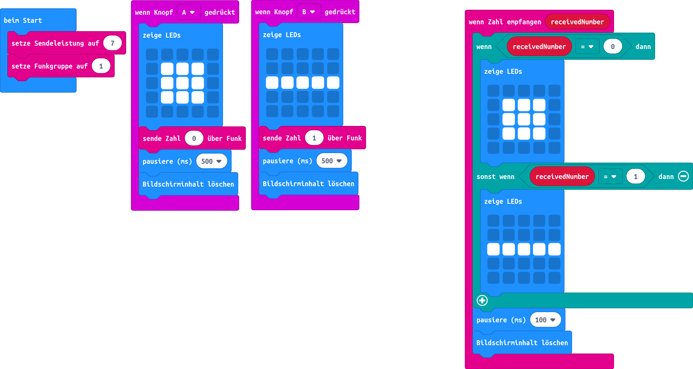

# Morsen
## Material:

+ 2 micro:bit

## Editor:
[https://makecode.microbit.org/](https://makecode.microbit.org/)

## Funktion:
Mit dieser Anleitung lernst du, wie sich mehrere micro:bit über Bluetooth unterhalten können. Betrachten wollen wir in diesem Experiment die Möglichkeit des Morsens.

### Morse-Alphabet

Buchstabe | Morse-Code
----------|-----------
A         | **· −**
B         | **− · · ·**
C         | **− · − ·**
D         | **− · ·**
E         | **·**
F         | **· · − ·**
G         | **− − ·**
H         | **· · · ·**
I         | **· ·**
J         | **· − − −**
K         | **− · −**
L         | **· − · ·**
M         | **− −**
N         | **− ·**
O         | **− − −**
P         | **· − − ·**
Q         | **− − · −**
R         | **· − ·**
S         | **· · ·**
T         | **−**
U         | **· · −**
V         | **· · · −**
W         | **· − −**
X         | **− · · −**
Y         | **− · − −**
Z         | **− − · ·**
{: class="table table-striped table-hover"}

Zahl   | Morse-Code
-------|-----------
1      | **· − − − −**
2      | **· · − − −**
3      | **· · · − −**
4      | **· · · · −**
5      | **· · · · ·**
6      | **− · · · ·**
7      | **− − · · ·**
8      | **− − − · ·**
9      | **− − − − ·**
0      | **− − − − −**
{: class="table table-striped table-hover"}

[Morse_Code.pdf](appendix/Morse_Code.pdf)

### Funktion:
Damit sich die beiden micro:bit miteinander über Bluetooth unterhalten können, müssen beide micro:bit in der gleichen Gruppe und einer passenden Signalstärke arbeiten. Diese beiden Funktionen legen wir im ersten Schritt an:

In diesem Beispiel verwenden wir den Kanal "1" und eine Übertragungsstärke von "7".
Der Knopf "A" soll ein kurzes Signal senden, der Knopf "B" steht für ein langes Signal.
Beginnen wir nun mit dem Knopf "A" und einem kurzen Signal:

### Zum Aufbau:

+ wir senden die Zeichenfolge kurz
+ das Display gibt einen Punkt für das kurze Signal für uns zur Kontrolle aus
+ nach 500 ms wird der Bildschirminhalt gelöscht

Machen wir weiter mit dem Knopf "B" und einem langen Signal:

### Zum Aufbau:

+ wir senden die Zeichenfolge lang
+ das Display gibt einen Strich für langes Signal für uns zur Kontrolle aus
+ nach 500 ms wird der Bildschirminhalt gelöscht

Unser micro:bit muss darauf reagieren, wenn Nachrichten empfangen werden. Dies müssen wir in einem weiteren Schritt festlegen. Danach haben wir auch das Programm komplett abgeschlossen.

### Zum Aufbau:

+ Wir beginnen mit der Funktion, wenn ein Datenpaket empfangen wurde
+ der empfangene String ist kurz, dann zeige einen Punkt (kleines Quadrat) an
+ warte 500ms und leere den Bildschirm
+ ist der empfangene String lang, dann zeige jetzt einen dicken Strich an
+ warte 500ms und leere den Bildschirm

Jetzt haben wir alle notwendigen Funktionen und können mit einem Test starten.

## Code

[microbit-morsen.hex](appendix/microbit-morsen.hex)
