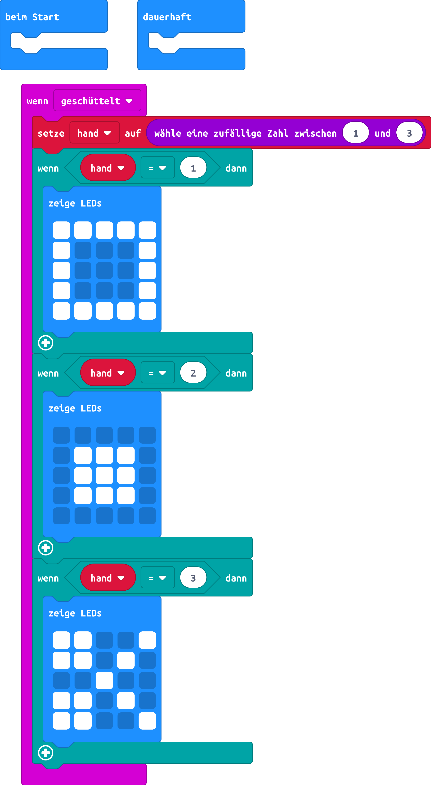

# Spiel Schere-Stein-Papier
## Material
* 1x micro:bit

## Material
* microbit

## Editor:

[https://makecode.microbit.org/](https://makecode.microbit.org/)

## Funktion:
Benutze den Beschleunigungssensor und die LED-Anzeige um ein Schere-Stein-Papier Spiel zu bauen das du mit deinen Freunden spielen kannst!

## Schaltplan

### Symbole

#### Schere:

#### Stein:

#### Papier:

## Code
[microbit-Schere-Stein-Papier.hex](appendix/microbit-Schere-Stein-Papier.hex)
