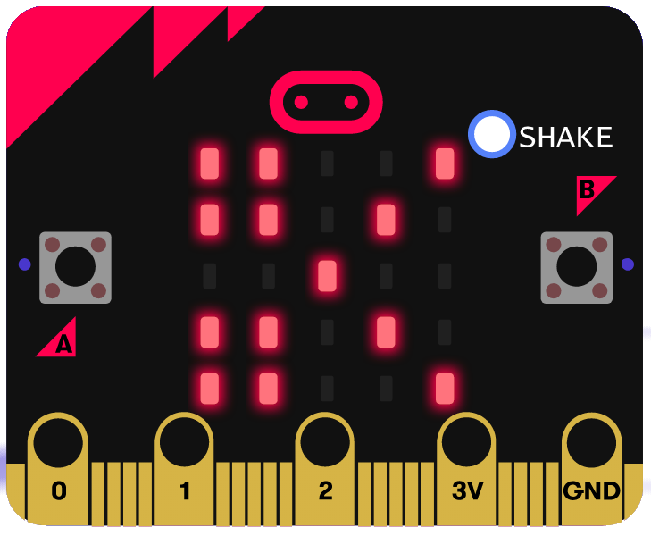
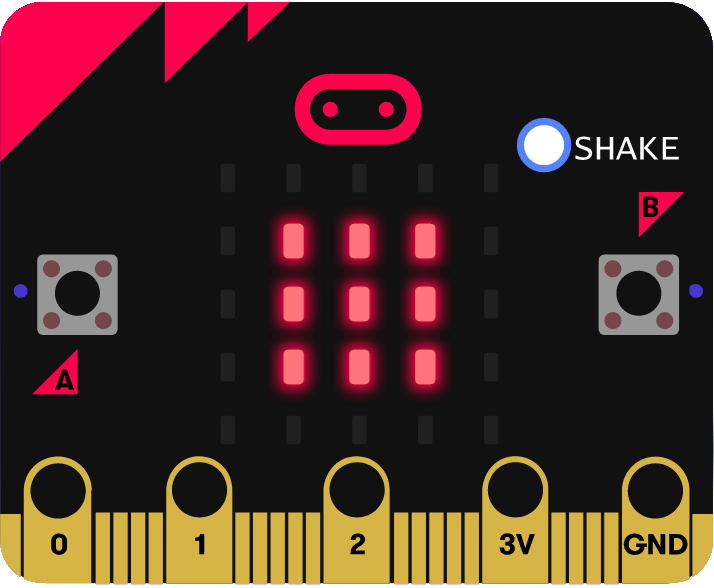
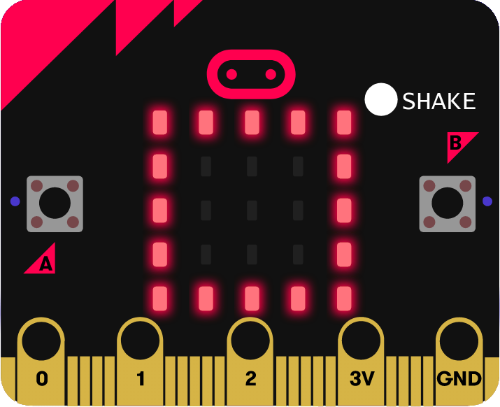

# Spiel Schere-Stein-Papier
## Material
* 1x micro:bit

## Editor

[https://makecode.microbit.org/](https://makecode.microbit.org/)

## Funktion
Benutze den Beschleunigungssensor und die LED-Anzeige um ein Schere-Stein-Papier Spiel zu bauen das du mit deinen Freunden spielen kannst!

## Schaltplan

### So funktioniert das Programm
Die zufällig ermittelte Zahl (zwischen 1 und 3) wird  nicht sofort angezeigt, sondern zunächst in der **Variable hand** gespeichert.

<b>Variablen:</b> Variablen sind kleine Speicherplätze, in denen man sich während eines Programms eine Zahl oder irgendetwas anders merken kann. Wenn das Programm beendet wird, werden diese Variablenspeicher automatisch wieder geleert. Variablen müssen im Makecode-Editor erst einmal auf der Blockpalette Variablen mit dem <b><i>Button Make a Variable</i></b> angelegt werden, bevor man diese benutzen kann.

#### Variablen im Makecode-Editor
Variablen sind kleine Speicherplätze, in denen man sich während eines Programms eine Zahl oder irgendetwas anders merken kann. Wenn das Programm beendet wird, werden diese Variablenspeicher automatisch wieder geleert. Variablen müssen im Makecode-Editor erst einmal auf der Blockpalette Variablen mit dem **Button Make a Variable** angelegt werden, bevor man diese benutzen kann. Anschließend kannst du das Symbol der neu angelegten Variablen in ein dafür vorgesehenes Feld eines Blocks im Programm ziehen. In der Gruppe Variablen stehen zusätzlich zwei verschiedene Blöcke zum Verändern der Variablen zur Verfügung, die leicht zu verwechseln sind, aber unterschiedliche Funktionen haben.
+ ändere Variable auf ... setzt die Variable auf einen bestimmten Wert.
+ ändere Variable um ... erhöht die Variable um einen bestimmten Wert.

Im Programm folgen drei verschiedene **wenn ... dann ...-Abfragen aus der Gruppe Logik**. Die Blöcke innerhalb der Klammer dieser Abfrage werden immer dann ausgeführt, wenn die Bedingung in der Abfrage wahr ist.

Alle diese Abfragen verwenden den Block **... = ... aus der Gruppe Logik**, um zu prüfen, ob der Wert der **Variable hand** einer der drei möglichen Zahlen entspricht. Ist das der Fall, wird das entsprechende Symbol auf der LED-Matrix angezeigt. Dazu wird der Block zeige LEDs aus der Gruppe Grundlagen verwendet. Hier kannst du durch Anklicken das gewünschte LED-Muster festlegen.

#### Blöcke duplizieren
Ähnliche Programmblöcke, wie hier die sechs** wenn ... dann ... Abfragen**, brauchen nicht jedes Mal komplett neu zusammengebaut zu werden. Klicke mit der rechten Maustaste auf einen Block und wähle im Kontextmenü Duplizieren. Automatisch wird eine Kopie des Blocks und aller ineinander verschachtelten Blöcke angelegt, die du an die gewünschte Position im Programm ziehen und weiter bearbeiten könnt.

### Symbole

#### Schere:

#### Stein:

#### Papier:

## Programmbeispiel
[microbit-Schere-Stein-Papier.hex](appendix/microbit-Schere-Stein-Papier.hex)
