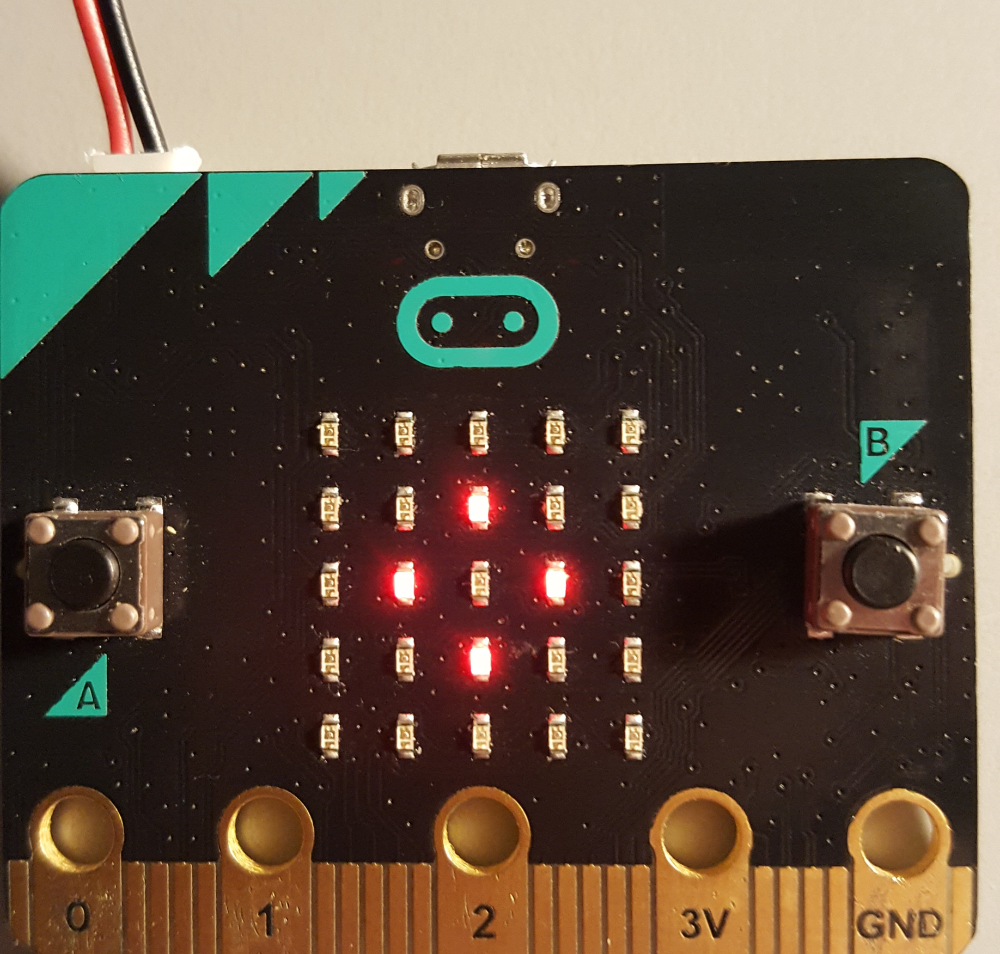
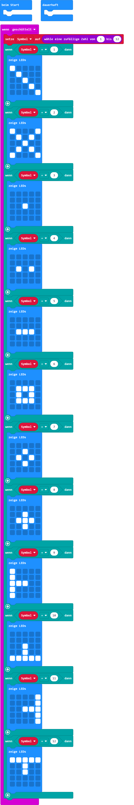

# Symbolschnappper

## Material:

+ mirco:bit
+ Symbolplättchen [Sybolschnapper.pdf](appendix/Sybolschnapper.pdf)

<b>Hinweis:</b> Du kannst einfach kariertes Papier benutzen, 5x5 (LED-Matrix) und die einzelnen Kästchen ausmalen.

## Editor:

[https://makecode.microbit.org/](https://makecode.microbit.org/)

## Funktion:

Durch Schütteln des mirco:bit wird in ein Symbol generiert.

### So funktioniert das Programm

Bei dem Spiel geht es darum, wer als Erstes das angezeigte Symbol schnappt, dass auf dem micro:bit dargestellt wird.

## Programmbeispiel
[microbit-symbolschnappper.hex](appendix/symbolschnappper.hex)
