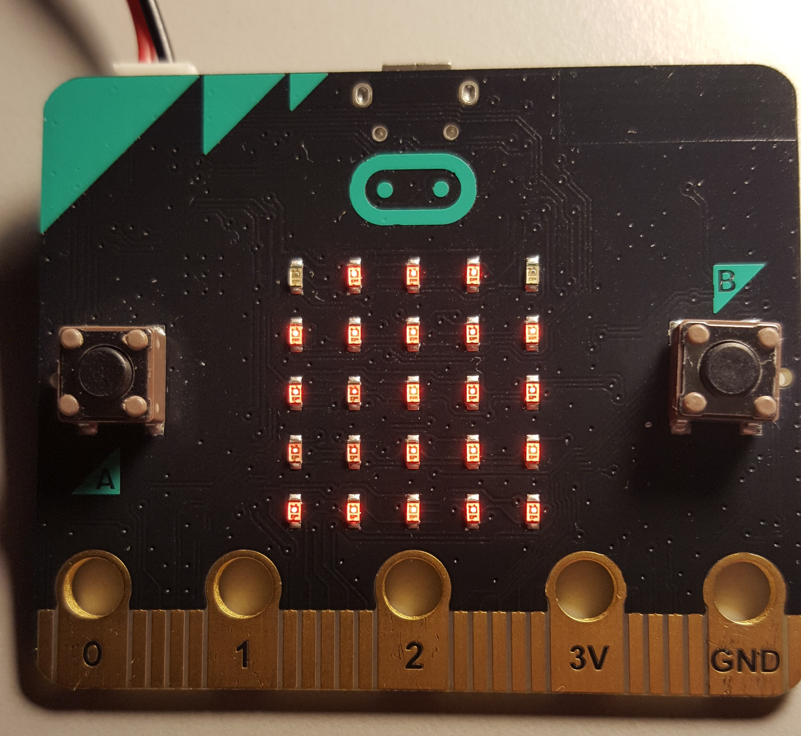
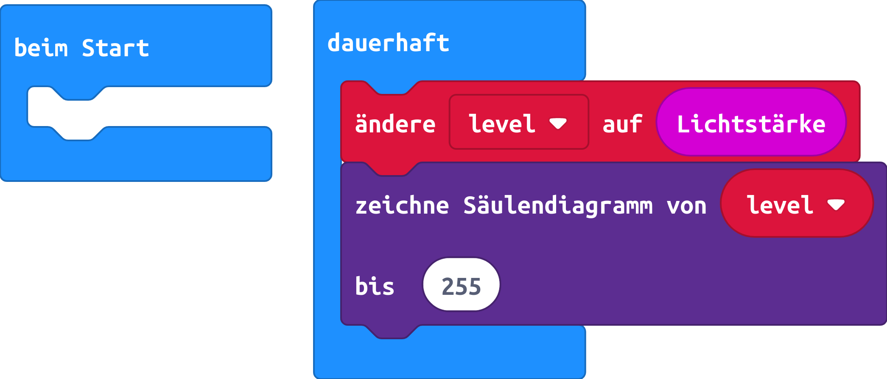

# Diagramm der Lichtstärke

## Material:

mirco:bit

## Editor

[https://makecode.microbit.org/](https://makecode.microbit.org/)

## Funktion

Die Lichtstärke wird als wachsendes Diagramm angezeigt. Die Lichtstärke kann beim micro:bit den Maximalwert von 255 erreichen.

### So funktioniert das Programm
Die LED-Matrix kann nicht nur zur Anzeige genutzt werden, sondern da Feld liefert auch die Lichtstärke an den micro:bit.
Die Lichtstärke wird zunächst in der **Variable level** gespeichert.

<b>Variablen:</b> Variablen sind kleine Speicherplätze, in denen man sich während eines Programms eine Zahl oder irgendetwas anders merken kann. Wenn das Programm beendet wird, werden diese Variablenspeicher automatisch wieder geleert. Variablen müssen im Makecode-Editor erst einmal auf der Blockpalette Variablen mit dem <b><i>Button Make a Variable</i></b> angelegt werden, bevor man diese benutzen kann.

#### Variablen im Makecode-Editor
Variablen sind kleine Speicherplätze, in denen man sich während eines Programms eine Zahl oder irgendetwas anders merken kann. Wenn das Programm beendet wird, werden diese Variablenspeicher automatisch wieder geleert. Variablen müssen im Makecode-Editor erst einmal auf der Blockpalette Variablen mit dem **Button Make a Variable** angelegt werden, bevor man diese benutzen kann. Anschließend kannst du das Symbol der neu angelegten Variablen in ein dafür vorgesehenes Feld eines Blocks im Programm ziehen. In der Gruppe Variablen stehen zusätzlich zwei verschiedene Blöcke zum Verändern der Variablen zur Verfügung, die leicht zu verwechseln sind, aber unterschiedliche Funktionen haben.
+ ändere Variable auf ... setzt die Variable auf einen bestimmten Wert.
+ ändere Variable um ... erhöht die Variable um einen bestimmten Wert.

Jetzt zeichnen wir ein wachsendes Diagramm der aktuellen Lichtstärke und geben diese als wachsendes Säulendiagramm aus.

## Programmbeispiel
[microbit-lichtstaerke_diagramm.hex](appendix/microbit-lichtstaerke_diagramm.hex)
