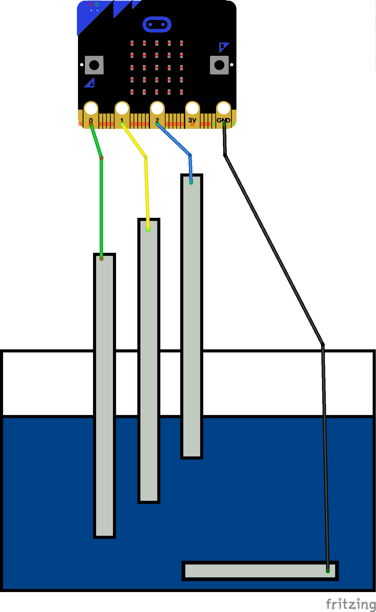

# Wasserstandssensor

## Material:

+ mirco:bit
+ 4 Krokodilklemmenkabel
+ Alufolie

## Editor:

[https://makecode.microbit.org/](https://makecode.microbit.org/)

## Funktion:

Falte für die Massekontakt aus der Alufolie vier Streifen. Legen
einen Streifen auf den Boden des Wasserbehälters und befestigen diesen dort.
Das Programm prüft nacheinander immer wieder die drei Pins P0, P1 und P2, um den Wasserstand zu ermitteln.
Der Wasserstand wird auch immer optisch in einem Diagramm dargestellt.

<b>Wichtig:</b> Achte bitte darauf, dass der micro:bit hierbei nicht nass wird!

## Schaltplan

## Programmbeispiel
[microbit-wasserstandssensor.hex](appendix/microbit-wasserstandssensor.hex)
