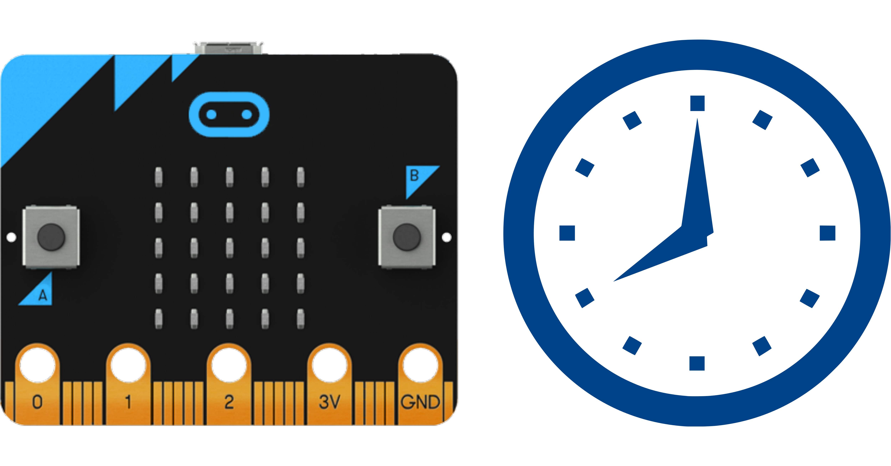

# Berührungsloser Zeitmesser beim Händewaschen

_**Händewaschen ist in Zeiten der Pandemie wichtiger denn je. Lerne, wie man mit dem micro:bit einen berührungslosen Zeitmesser erstellt.**_

## Material:

+ mirco:bit

## Editor:

[https://makecode.microbit.org/](https://makecode.microbit.org/)

<b>Wichtig:</b> Achte bitte darauf, dass der micro:bit nicht nass wird!

<!--Anleitung -->
#### Die Hände sollten für 30 Sekunden gewaschen werden!

Die Frage war, welche eingebauten Sensoren können wir nutzen?
Sicher ein Button ist sehr einfach. Aber das bedeutet auch, dass man den micro:bit berühren muss. Das wollen wir vermeiden. Kompass und Lagesensor scheiden auch aus.

Eine Lösung könnte ein Winken vor dem Helligkeitssensensor sein. Wir erinnern uns, dass die LED-Matrix auch als Helligkeitssensensor genutzt werden kann.

Die Lösung scheint zu einfach. Nur eine Variable für einen Schwellenwert setzten. Wenn der Helligkeitsmesser unter den Wert fällt, läuft der Zeitmmesser an und zeigt die 30 Sekunden optisch an. Dann kommen noch zwei Herzen. Dann ist die Anzeige leer.

#### Problem mit dem Umgebungslicht
Das Umgebungslicht ändert sich von Raum zu Raum und
die Lichtverhältnisse ändern sich im Laufe des Tages. Das würde es nicht tun den micro:bit für jede Situation neu zu programmieren.

Das Badezimmer in einem Haus, Büro oder einer Schule. Jede andere Situation würde erfordern, dass man das überwacht und unterschiedliche Werte der Lichtstärke für jeden Raum anders einstellt.

#### Probleme mit der Lichtstärke
Die Lichtstärke könnte z.B. 67 am Morgen betragen.
Die Lichtverhältnisse sind am Nachmittag oder an einem wolkigen Tag wieder anders.

Das Programmbeispiel berücksichtigt die Veränderung der Lichtstärke. Gleichzeitig wird auch die Batterie geschont, da nur Veränderungen der Lichtstärke berücksichtigt werden.
<!--Anleitung Ende-->

<iframe src="https://player.vimeo.com/video/453672586" width="640" height="480" frameborder="0" allow="autoplay; fullscreen" allowfullscreen></iframe>

## Programmbeispiel
[microbit-touchless_handwash-timer.hex](appendix/microbit-touchless_handwash-handwashtimer.hex)
