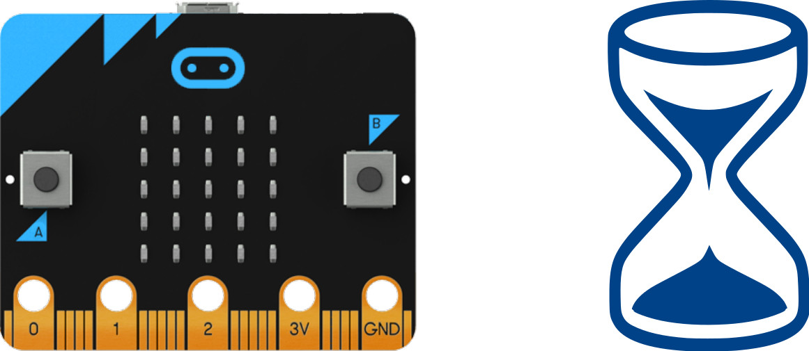
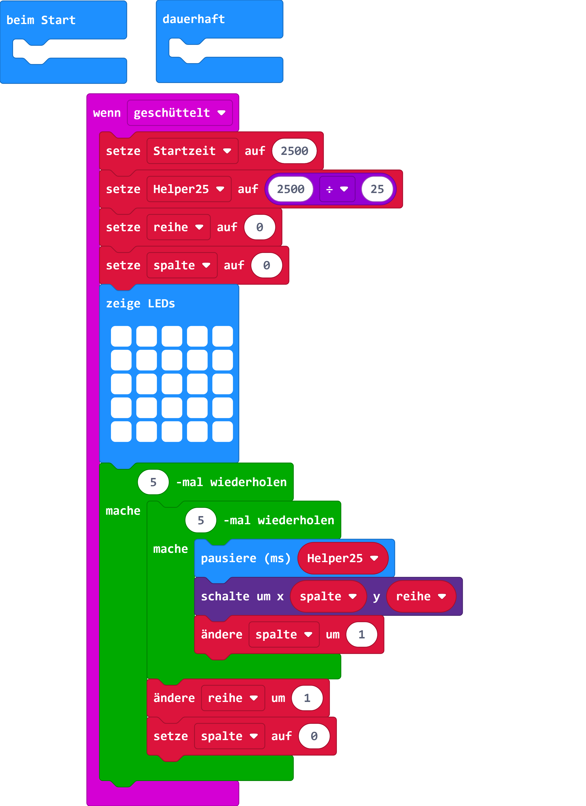

# Sanduhr

## Material:

+ mirco:bit

## Editor:

[https://makecode.microbit.org/](https://makecode.microbit.org/)

## Funktion:
<!--Anleitung -->
Durch Schütteln des micro:bit wird der Sand (LED-Matrix) wieder aufgefüllt. Der Sand wird aber sofort wieder abgebaut.  

## Programmbeispiel
[microbit-sanduhr.hex](appendix/microbit-sanduhr.hex)
