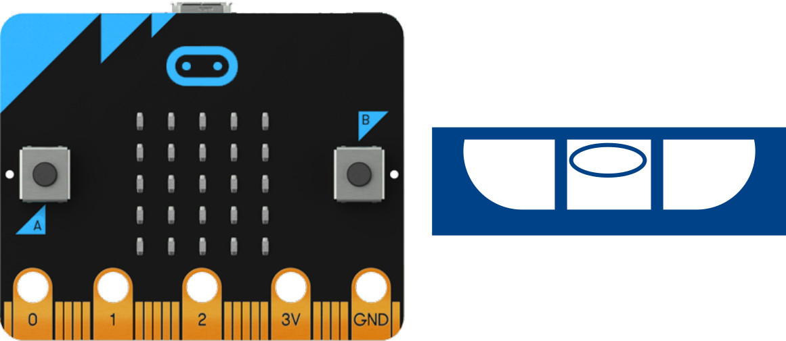
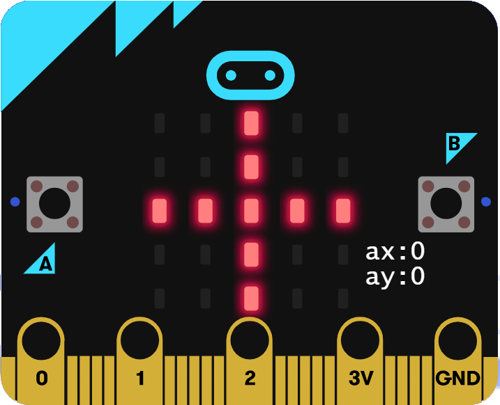

# Wasserwaage

## Material:

+ mirco:bit

## Editor:

[https://makecode.microbit.org/](https://makecode.microbit.org/)

## Funktion:

<!--Anleitung -->
Du baust mit dem micro:bit eine Wasserwaage.
Für das Projekt nutzen wir den Beschleunigungssensor des micro:bit.
Wir messen die X-Achse und die Y-Achse.
Wenn alles gerade ist, dann zeigt der micro:bit das optisch an.

## Programmbeispiel
[microbit-wasserwaage.hex](appendix/microbit-wasserwaage.hex)
