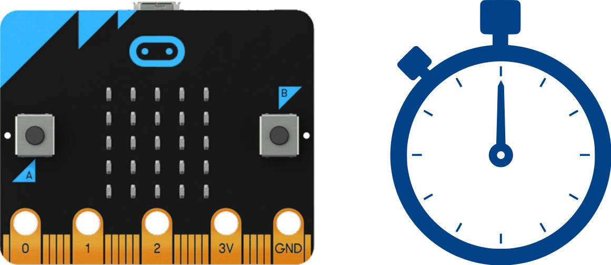
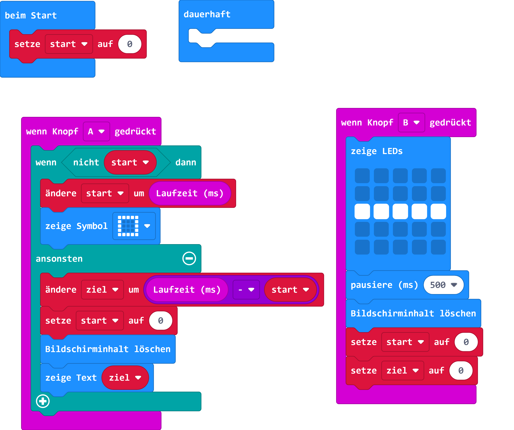
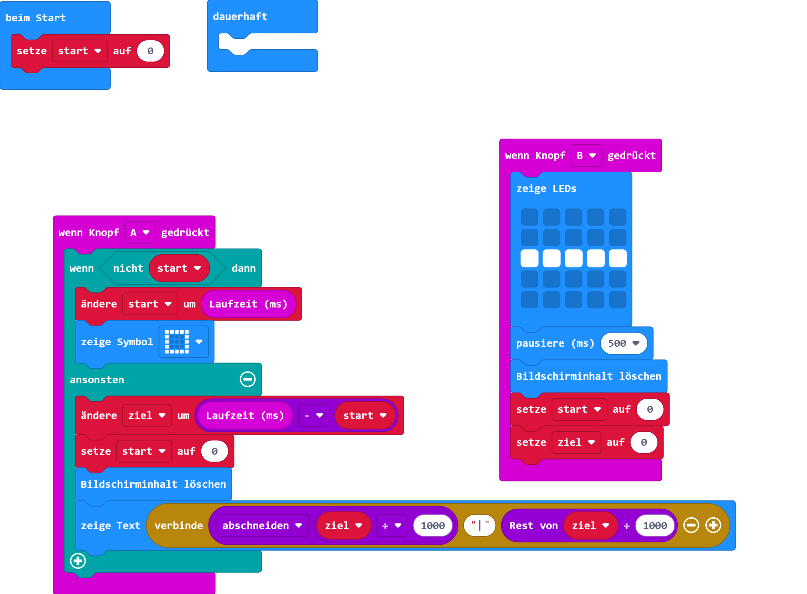

# Stoppuhr

## Material

+ mirco:bit

## Editor

[https://makecode.microbit.org/](https://makecode.microbit.org/)

## Funktion
<!--Anleitung -->
Knopf "A" startet die Stoppuhr und hält die Stoppuhr, bei einem weiteren Drücken, an.
Die Ausgabe erfolgt über die LED-Matrix in Millisekunden.
Knopf "B" stellt die Stoppuhr zurück.

## Programmbeispiel
[microbit-stoppuhr.hex](appendix/microbit-stoppuhr.hex)

## Formatierte Ausgabe in Sekunden und der Rest in Millisekunden

Knopf "A" startet die Stoppuhr und hält die Stoppuhr, bei einem weiteren Drücken, an. Knopf "B" stellt die Stoppuhr zurück. Die Ausgabe erfolgt über die LED-Matrix in Sekunden
und der Rest in Millisekunden. Getrennt wird durch ein "|"

## Programmbeispiel
[microbit-stoppuhr_v2.hex](appendix/microbit-stoppuhr_v2.hex)
