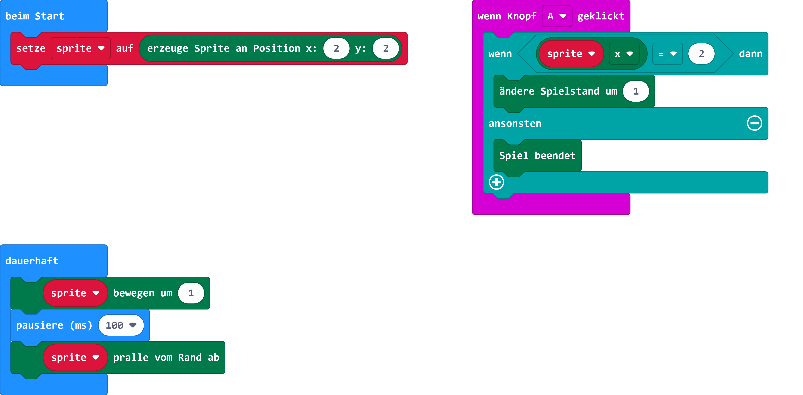

# Fang den Punkt

## Material

+ mirco:bit

## Editor

[https://makecode.microbit.org/](https://makecode.microbit.org/)

## Funktion

Fang den Punkt ist ein Geschicklichkeitsspiel, bei dem der Spieler genau dann A drücken muss, wenn der Punkt die Mitte des Bildschirms erreicht hat. Dieses Tutorial zeigt, wie man die Spiele-Engine verwendet.

## Programmbeispiel
[microbit-fang_den_dot.hex](appendix/microbit-fang_den_dot.hex)
