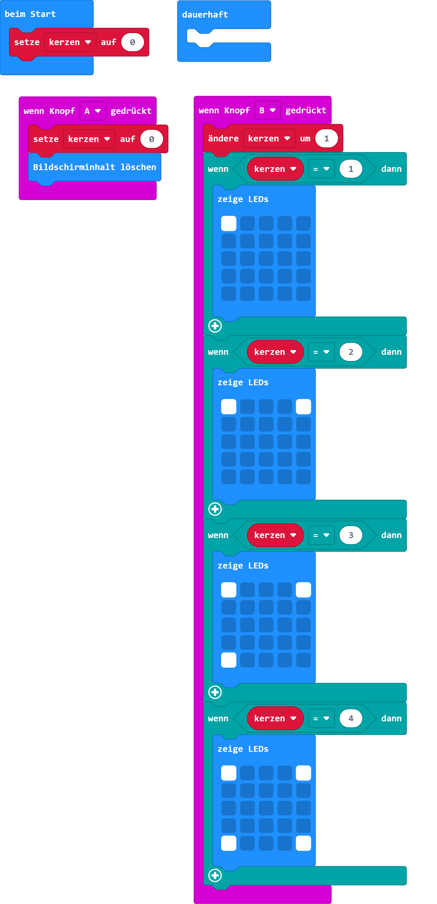

# Adventskranz

## Material:

+ mirco:bit

## Editor:

[https://makecode.microbit.org/](https://makecode.microbit.org/)

## Funktion:
<!--Anleitung -->
Knopf "A" stellt den Adventskranz zurück.
Knopf "B" bringt mit jedem Drücken eine weitere LED zum Leuchten.

## Programmbeispiel
[microbit-adventskranz.hex](appendix/microbit-adventskranz.hex)
