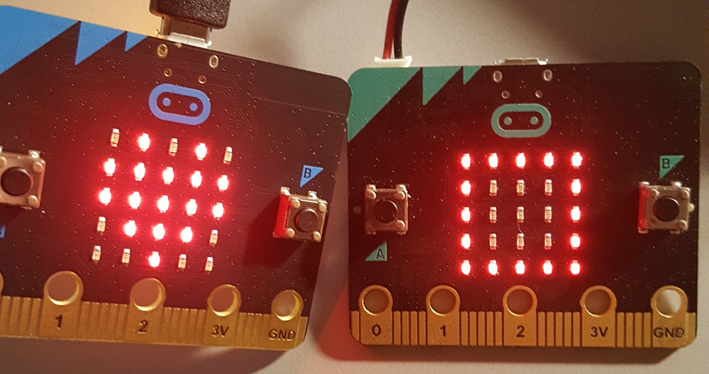

# Versteckte mirco:bit finden

## Material:

+ mirco:bit

## Editor:

[https://makecode.microbit.org/](https://makecode.microbit.org/)

## Funktion:

Wir benötigen für das Experiment zwei unterschiedliche Programmbeispiele:

### Finder

Den Finder benötigen wir, um die verstecken Micro:Bit zu finden. Wichtig ist, dass sich sowohl Finder, wie auch die versteckten Micro:Bit den gleichen Funkkanal nutzen. Daher findet du auch unten die passenden Programmbeispiele.

Ist dein Finder in der Nähe eines versteckten Micro:Bit?
Um festzustellen, wie weit oder wie nah die Funksender entfernt sind, verwenden wir die Signalstärke jedes Funkpakets, das von den Sendern gesendet wird. Die Signalstärke reicht von -128dB (schwach) bis -42dB (sehr stark). Wenn du dich einem versteckten Micro:Bit nahe bist, wir das mit einem großen Quadrat auf deiner LED-Matrix angezeigt.

### versteckte Mirco:bit

Befinden sich im gleichen Funkkanal zum Finder. Bitte diese Programmbeispiel auf alle Micro:Bit aufspielen, die versteckt werden sollen.

Auf dem Bild ist links ein versteckter Micro:bit, der von dem Finder gefunden wurde. Versteckte Platinen sind an dem schlagenden Herz zu erkennen.

## Programmbeispiele

### Finder

[microbit-microbit-finder.hex](appendix/microbit-microbit-finder.hex)

### versteckte Mirco:Bit

[microbit-microbit-verstecken.hex](appendix/microbit-microbit-verstecken.hex)
