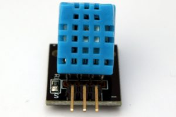
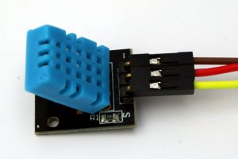
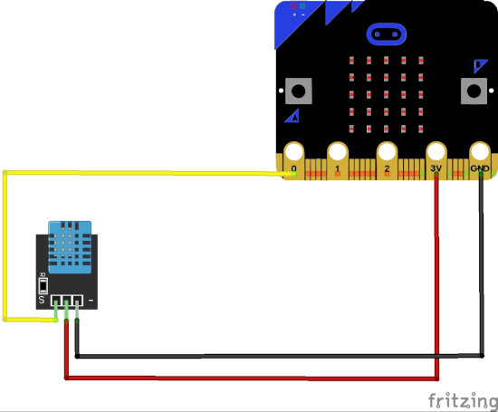

# Messen von Temperatur und Feuchtigkeit mit einem micro:bit

Lerne mit einem fertigen Temperatur / Luftfeuchtigkeits-Sensor den micro:bit zu erweitern.

## Material:

+ mirco:bit
+ fertiger Temperatur / Luftfeuchtigkeits-Sensor
+ 3 Kabel
+ 3 Krokodilklemmenkabel

## Editor:

[https://makecode.microbit.org/](https://makecode.microbit.org/)

## Funktion:
Für das Experiment wird ein fertiger Temperatur/Luftfeuchtigkeits-Sensor verwendet.

## Zum Aufbau:

## Programmbeispiel
[microbit-measure-temperature_and_humidity.hex](appendix/microbit-measure-temperature_and_humidity.hex)
