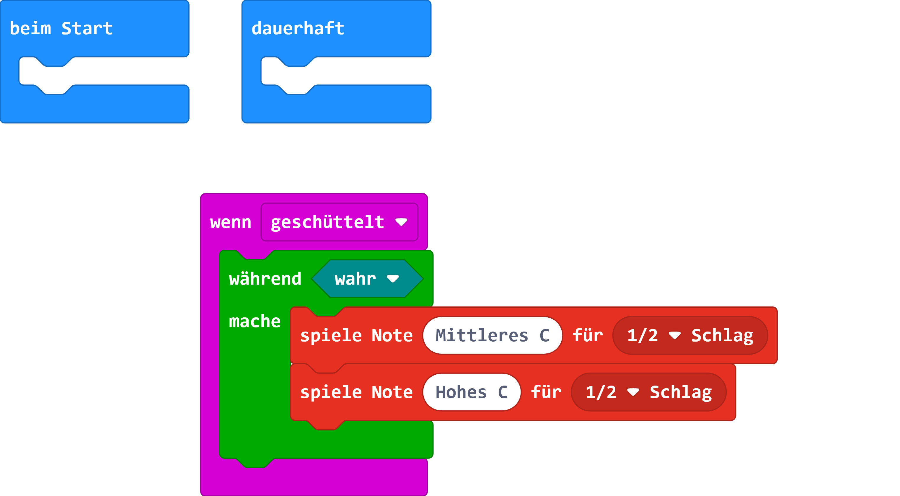
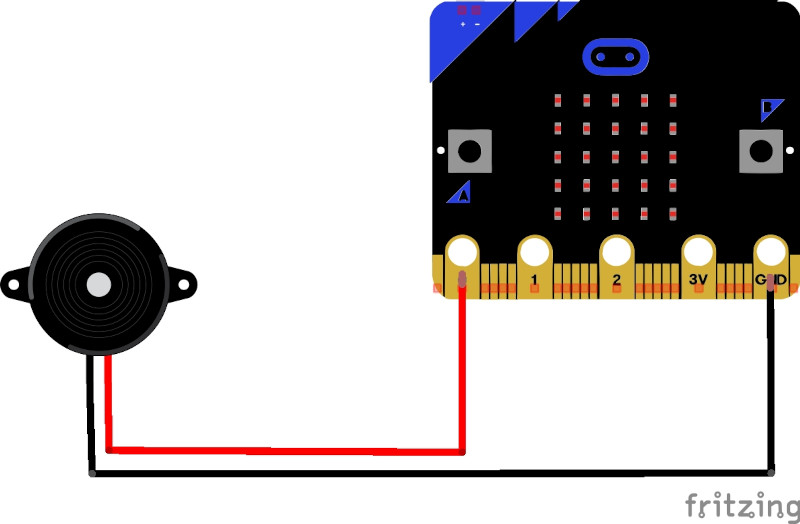

# Alarm mit einem micro:bit

Lerne einen Alarm mit dem micro:bit umsetzen.

## Material:

+ mirco:bit

## Editor:

[https://makecode.microbit.org/](https://makecode.microbit.org/)

## Funktion:

## Programmbeispiel

[microbit-alarm.hex](appendix/microbit-alarm.hex)
