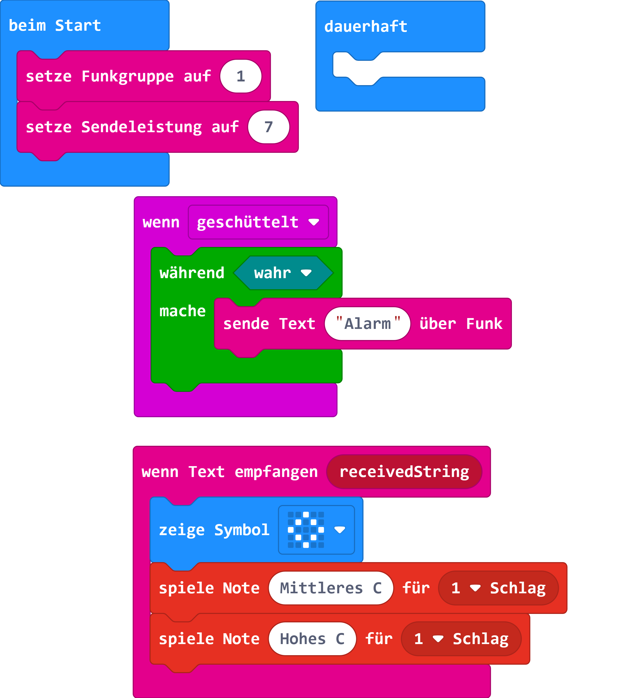
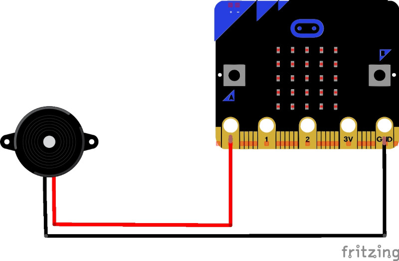

# Stiller Alarm mit micro:bit

Mit dieser Anleitung lernst du, wie sich mehrere micro:bit über Funk unterhalten können.
Bei einem stillen alarm erfolgt die alarmierung per Funk. Daher brauchen auch beide micro:bit das gleiche programmbeispiel.

## Material

+ zwei mirco:bit

## Editor

[https://makecode.microbit.org/](https://makecode.microbit.org/)

## Funktion

## Programmbeispiel

[microbit-stilleralarm.hex](appendix/microbit-stilleralarm.hex)
