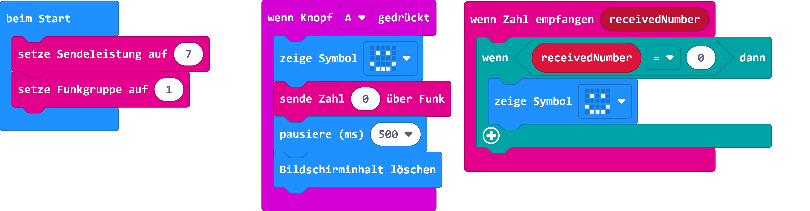

# Schenke ein Lächeln

<!---->

# Einführung zum Ziel 3 - Gesundheit und Wohlergehen

## Material:

+ mirco:bit

## Editor:

[https://makecode.microbit.org/](https://makecode.microbit.org/)

Mit dieser Anleitung lernst du, wie sich mehrere micro:bit über Funk unterhalten können.

## Funktion:
Damit sich die beiden micro:bit miteinander über Funk unterhalten können, müssen beide micro:bit in der gleichen Gruppe und einer passenden Signalstärke arbeiten. Diese beiden Funktionen legen wir im ersten Schritt an:

## Zum Aufbau:

+ Sende mit Drücken der Taste A ein Lächeln.
+ warte 500ms und leere deinen Bildschirm.
+ Wir beginnen mit der Funktion, wenn ein Datenpaket empfangen wurde.

## Programmbeispiel
[microbit-send-a-smile.hex](appendix/microbit-send-a-smile.hex)

### Nachhaltigkeitsziele – Jahresaktion

Beschäftigte dich mit den Nachhaltigkeitszielen. [VCP-Jahresaktion zu den Nachhaltigkeitszielen](https://www.vcp.de/pfadfinden/sdg-jahresaktion/)
