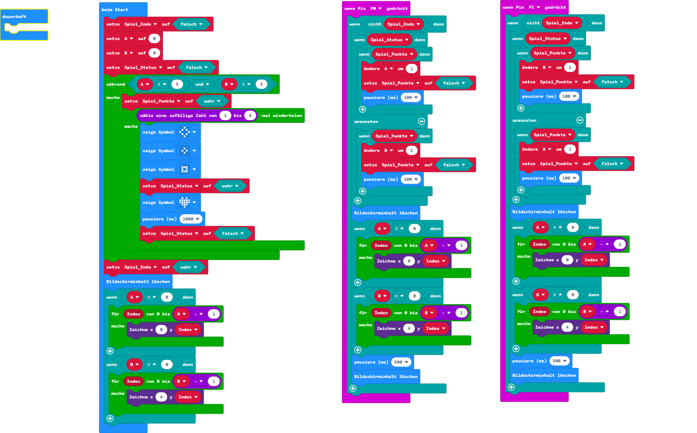

# Reaktionsspiel

## Material:

+ mirco:bit

## Editor:

[https://makecode.microbit.org/](https://makecode.microbit.org/)

## Funktion:
Das Reaktionspiel jede\*r Spieler\*in hat einen Knetekontakt für den Sensor. Dazu gibt es für jeden einen Massekontakt, den entweder beide in der einen Hand
halten oder sie legen ihn auf eine leitfähige Oberfläche, zum Beispiel eine Metallplatte, die beide Spieler\*in berühren können.

Am besten halten beide Spieler\*innen den Massekontakt immer in der Hand und berühren dann mit der anderen Hand im richtigen Moment den Sensorkontakt. Dabei müssen Sie darauf achten, die Sensorkontakte, wenn sie nicht berühren, auf einer nicht leitfähigen Oberfläche abzulegen, damit sie keine Verbindung zum Massekontakt haben.

### Spielregeln

- Am Anfang blinken zufällig Symbole
- Wenn das Herz erscheint, müssen die Spieler schnell ihren Kontakt berühren. Wer seinen Kontakt zuerst berührt, bekommt einen Punkt.
- Berührt ein\*e Spieler\*in den Kontakt zu früh, bekommt die\*der Gegner\*in den Punkt. In jeder Runde wird nur ein Punkt vergeben
- Hat ein\*e Spieler\*in fünf Punkte, ist das Spiel zu Ende
 Die LEDs zeigen am Ende die Punkte an.

#### Das Programm
Die Variablen im Spiel:
+ A - Punkte der\*der Spieler\*in A
+ B - Punkte der\*der Spieler\*in B
+ Spiel_Ende - Logikwert, der angibt, ob das Spielende erreicht ist In diesem Fall werden keine Sensorkontakte mehr abgefragt, damit weitere Berührungen keine weiteren Punkte geben
+ index - Schleifenzähler
+ Spiel_Punkte - Logikwert, der angibt, ob in einer Spielrunde noch ein Punkt zu vergeben ist.
+ Spiel_Status - Logikwert, der angibt, ob das Herz gerade leuchtet In diesem Moment bekommt die\*der Spieler\*in beim Berühren seines Sensorkontaktes einen Punkt. Andernfalls, also wenn der Sensorkontakt zu früh berührt wird, bevor das Herz leuchtet, bekommt die\*der Gegner\*in den Punkt.

Das Spiel läuft in einem großen beim Start-Block. Am Anfang werden die Punktestände beide\*r Spieler\*innen
auf 0 gesetzt und die Variablen Spiel_Ende und Spiel_Status auf falsch gesetzt. Das bedeutet: Jetzt ist nicht der richtige Zeitpunkt, den eigenen Sensorkontakt zu berühren. Tut man es doch, bekommt die\*der Gegner\*in den Punkt.

Das Spiel läuft so lange, bis einer die\*der Spieler\*in fünf Punkte geschafft hat. Die Hauptschleife des Spiels wird
also solange wiederholt, wie beide Spieler\*innen noch weniger als fünf Punkte haben. Die Bedingung in der
während ... mache ...-Schleife besteht aus einem Block ... und ... und zwei Blöcken ... < 5

<!-- ToDo  Spielbrettvorlage & Video -->

<iframe src="https://player.vimeo.com/video/467067202" width="640" height="480" frameborder="0" allow="autoplay; fullscreen" allowfullscreen></iframe>

## Programmbeispiel
[microbit-reaktionsspiel.hex](appendix/microbit-reaktionsspiel.hex)
