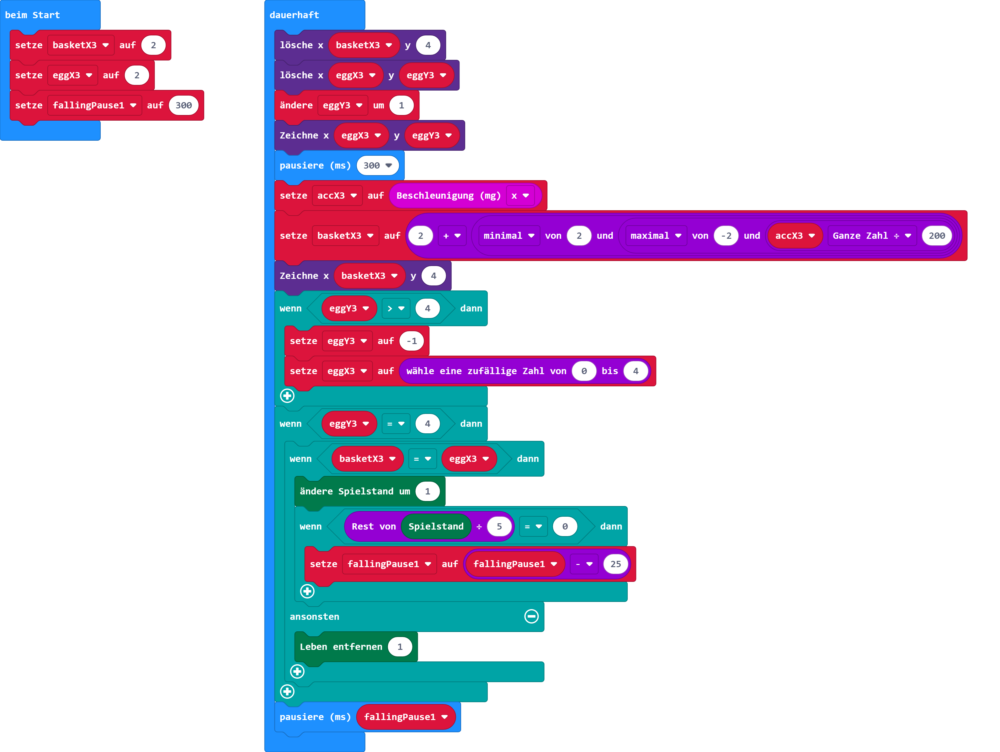

# Spiel zur Ostereiersuche

## Material:

+ mirco:bit

## Editor:

[https://makecode.microbit.org/](https://makecode.microbit.org/)

## Funktion:

## Programmbeispiel

[microbit-microbit-ostereiersuche.hex](appendix/microbit-microbit-ostereiersuche.hex)
