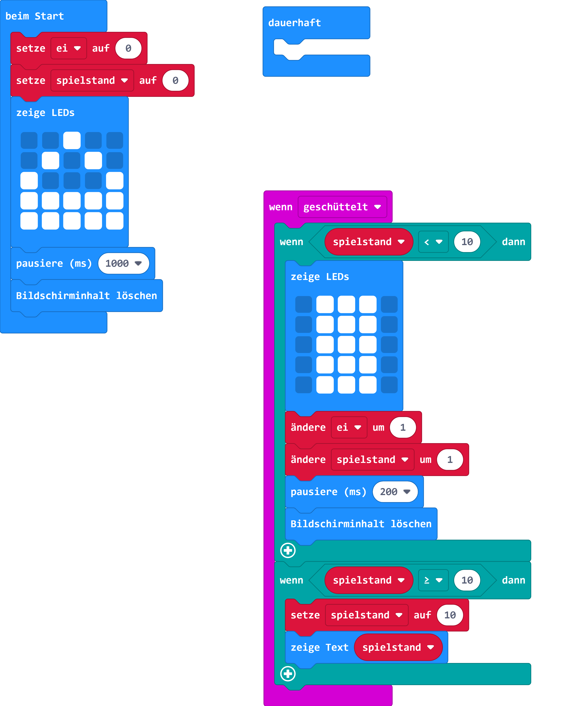

# Spiel zum Ostereiersammeln

## Material:

+ mirco:bit

## Editor:

[https://makecode.microbit.org/](https://makecode.microbit.org/)

## Funktion:

Für das Spiel benötigen wir zwei Variablen:
- ei
- spielstand

Wenn das Programm startet, wird kurz ein Sammelkorb angezeigt.

Mit jedem Schütteln der Platine wird ein weiteres Ei angezeigt.

Wenn du zehn Eier in deinem Korb gelegt hast wird dir dein Spielstand angezeigt.

## Programmbeispiel

[microbit-ostereiersuche.hex](appendix/microbit-ostereiersuche.hex)
