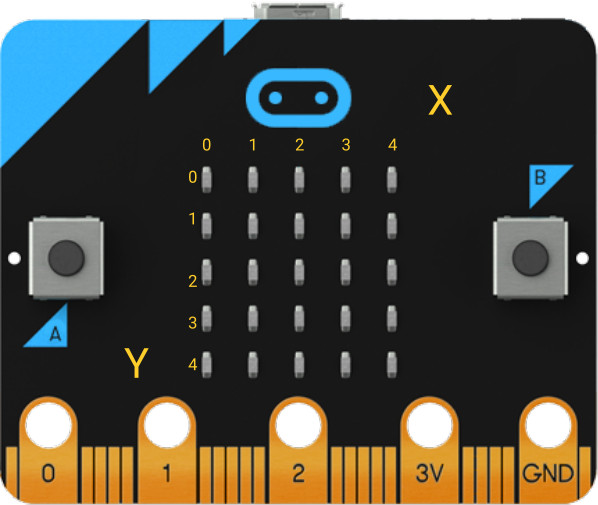
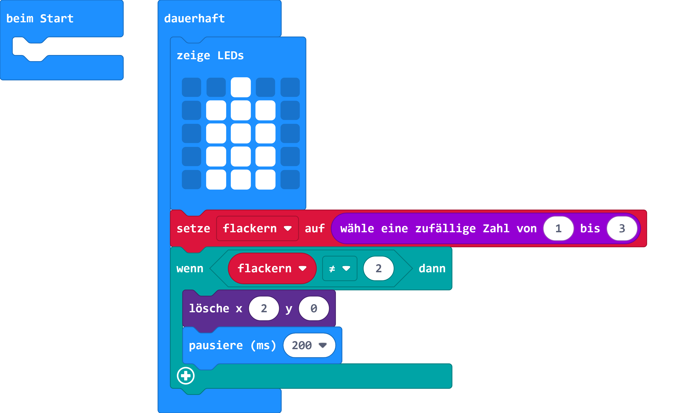

# Kerze

## Material:

+ mirco:bit

## Editor:

[https://makecode.microbit.org/](https://makecode.microbit.org/)

## Funktion:

Eine zufällige Zahl zwischen 1 und 3 wird in der Variable flackern gespeichert.
Dieser Variable wird benutzt um eine LED zufällige an- und aus zu schalten. So wird der Eindruck erweckt, dass die Flamme flackert.

### LED-Matrix Koordinaten

Die LEDs auf einer Matrix des Micro:Bit sind in Spalten und Spalten angeordnet. Es werden immer Zahlen von 0 bis 4 verwendet. Das Programm kann eine bestimmte Koordinate löschen.

## Programmbeispiel

[microbit-microbit-candle.hex](appendix/microbit-microbit-candle.hex)
