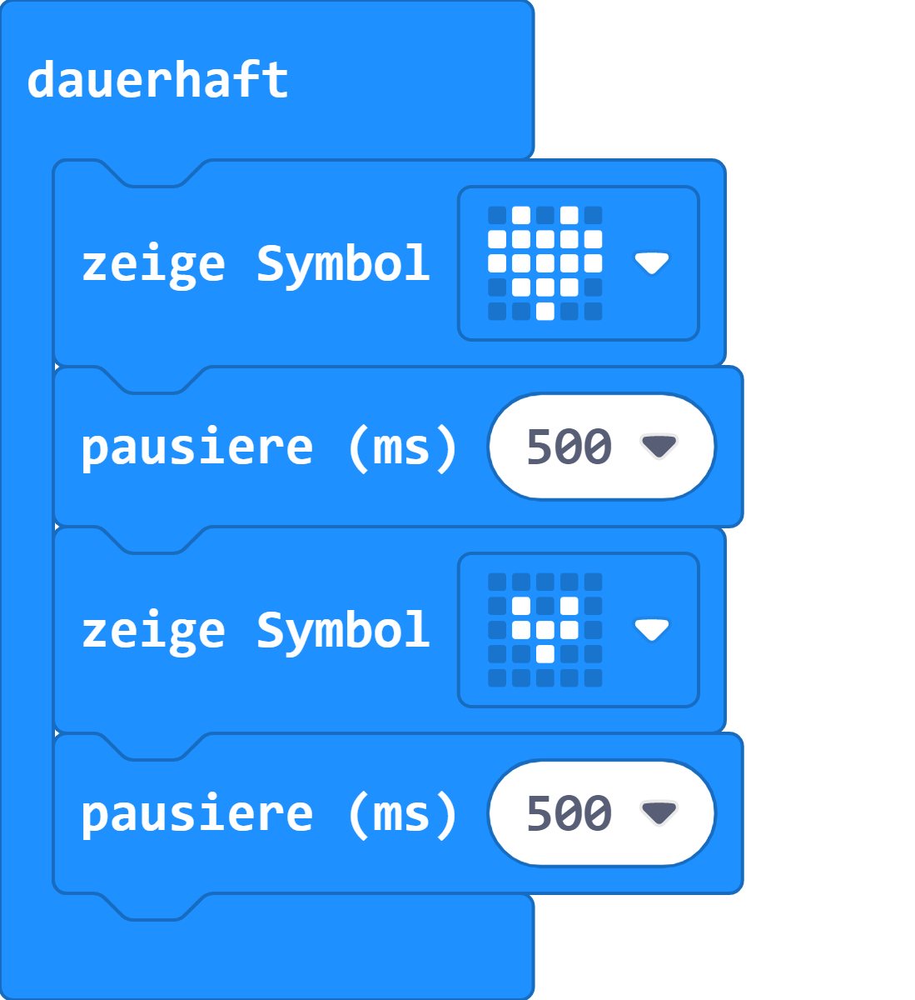

# Schlagendes Herz

## Material:

+ mirco:bit

## Editor:

[https://makecode.microbit.org/](https://makecode.microbit.org/)

## Funktion:

## Programmbeispiel
[microbit-schlagendes-herz.hex](appendix/microbit-schlagendes-herz.hex)
