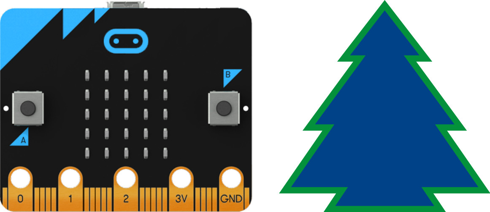
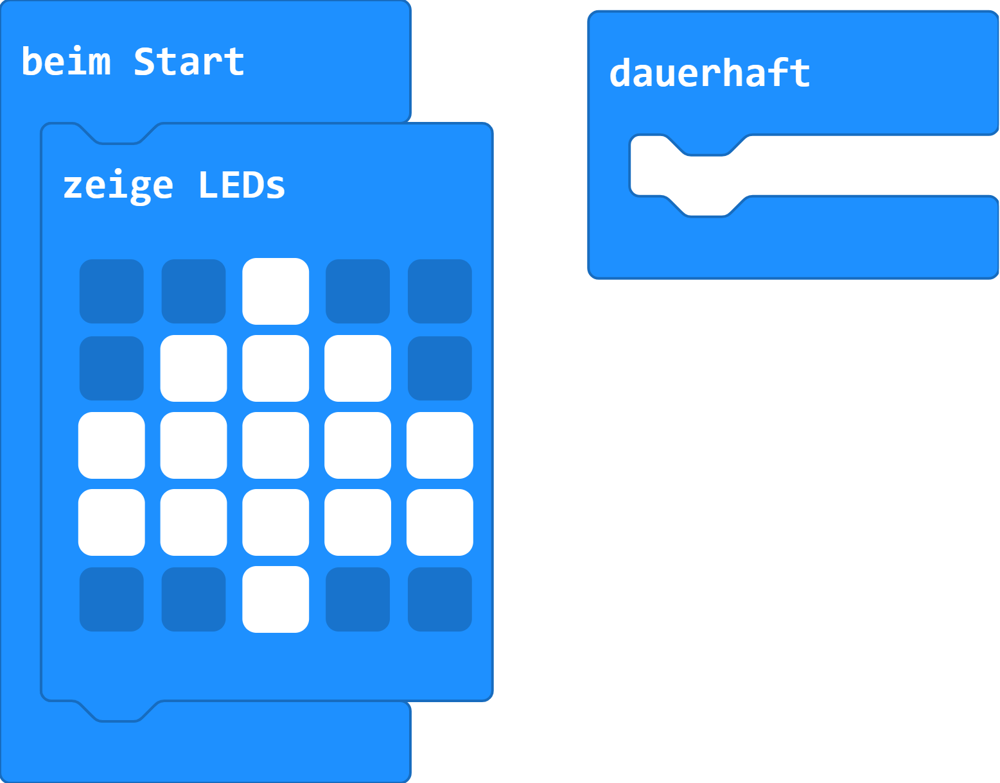

# Weihnachtbaum

## Material

+ mirco:bit

## Editor

[https://makecode.microbit.org/](https://makecode.microbit.org/)

## Funktion
<!--Anleitung -->

## Programmbeispiel

[microbit-firtree.hex](appendix/microbit-firtree.hex)
