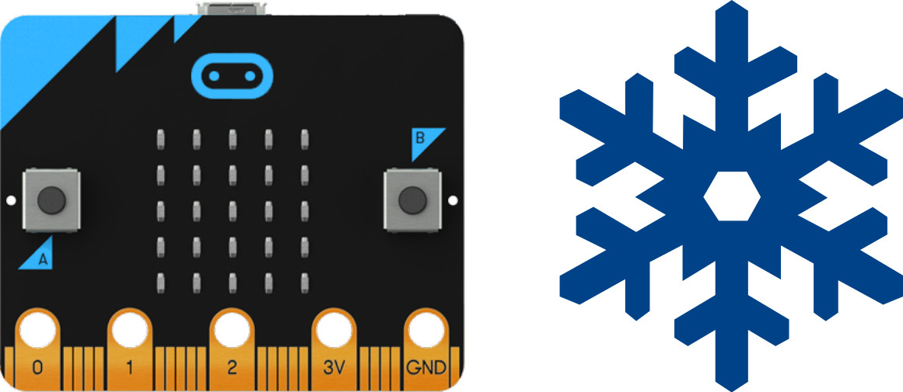
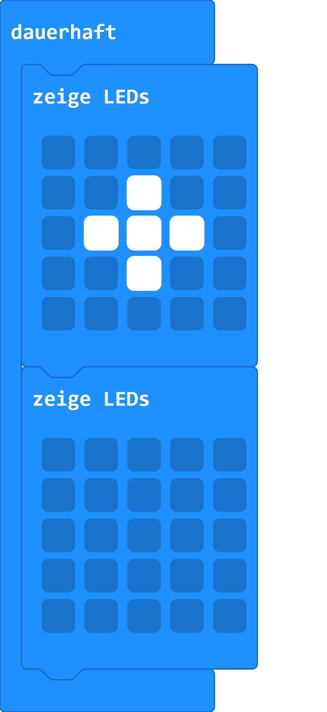
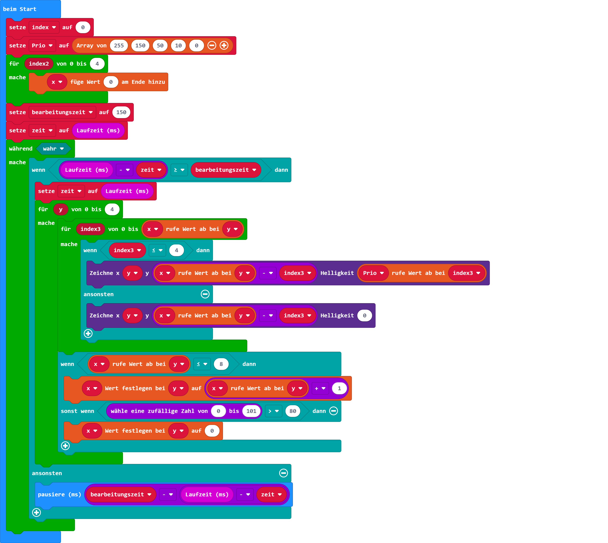

# Schneefall

## Material:

+ mirco:bit

## Editor:

[https://makecode.microbit.org/](https://makecode.microbit.org/)

## Funktion:

Für dieses Projekt gibt es zwei Lösungen.
Die erste ist eine sehr einfache Animation einer Schneeflocke.

Die zweite Lösung ist schon aufwändiger und animiert den Schneefall über die gesamte LED-Matrix.

In den Programmbeispielen findest du beide Programmbeispiele.

## Programmbeispiele
[microbit-snowfall1.hex](appendix/microbit-snowfall1.hex)

[microbit-snowfall2.hex](appendix/microbit-snowfall2.hex)
