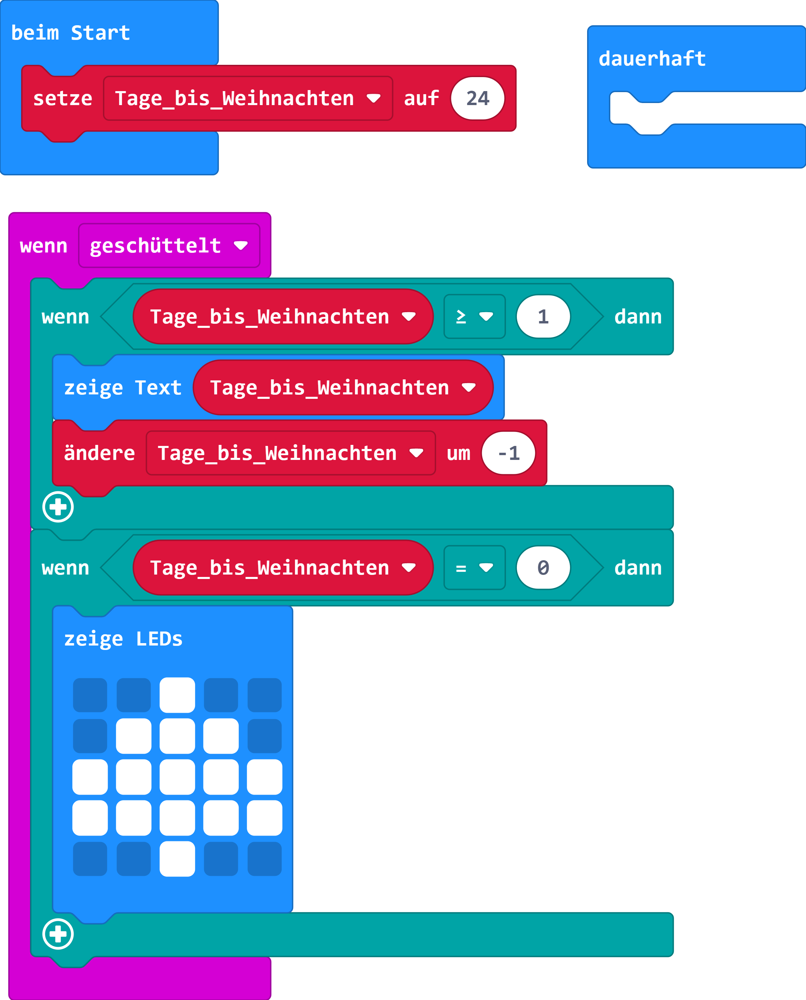
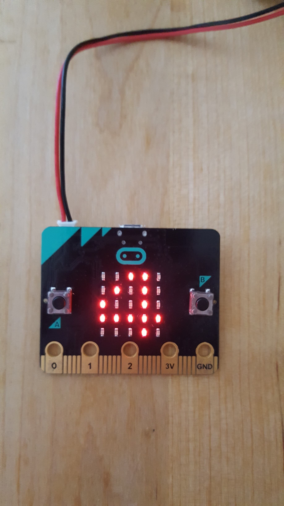
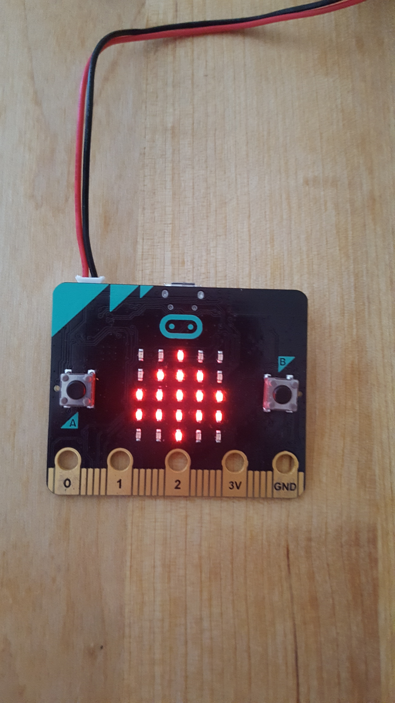

# Zähle Tage bis Weihnachten rückwärts

## Material:

+ mirco:bit

## Editor:

[https://makecode.microbit.org/](https://makecode.microbit.org/)

## Funktion:

Zähle die Tage bis Weihnachten rückwärts.
Mit jedem Schütteln des micro:bit wird ein Tag zurück gezählt.
Wenn Weihnachten (der Wert 0) erreicht wird, dann wird ein Weihnachtsbaum angezeigt.

## Programmbeispiele
[microbit-Countdown_to_Christmas.hex](appendix/microbit-Countdown_to_Christmas.hex)
