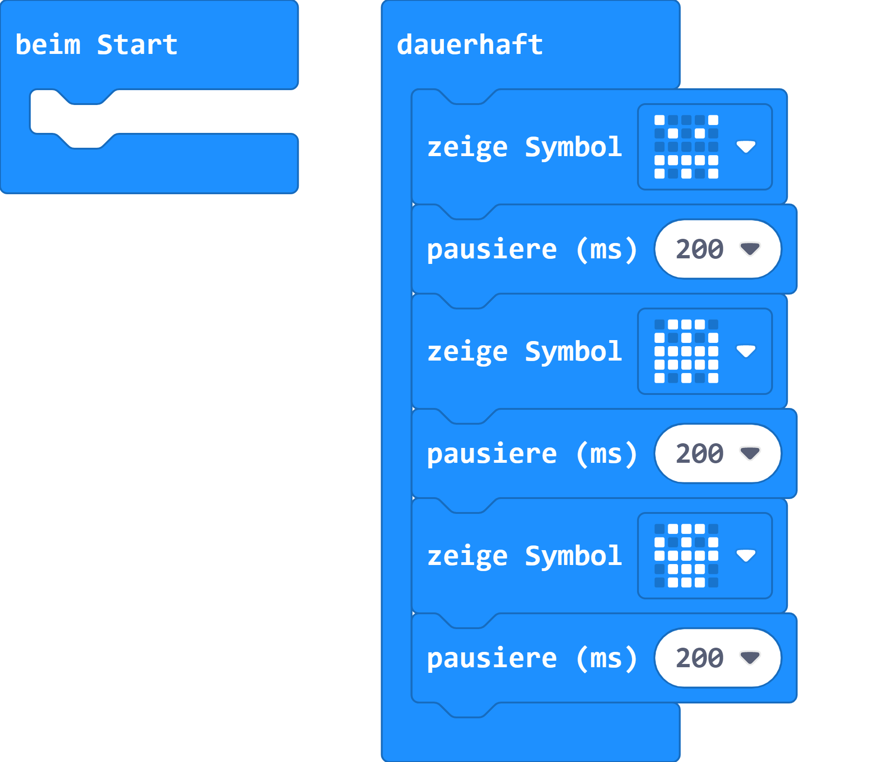

# Gruselige Gesichter

## Material:

+ mirco:bit

## Editor:

[https://makecode.microbit.org/](https://makecode.microbit.org/)

## Funktion:

<iframe src="https://player.vimeo.com/video/471694496" width="640" height="1138" frameborder="0" allow="autoplay; fullscreen" allowfullscreen></iframe>

## Programmbeispiel
[microbit-gruselige-gesichter.hex](appendix/microbit-gruselige-gesichter.hex)
