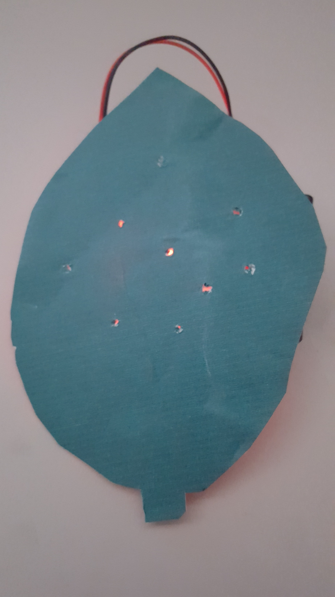
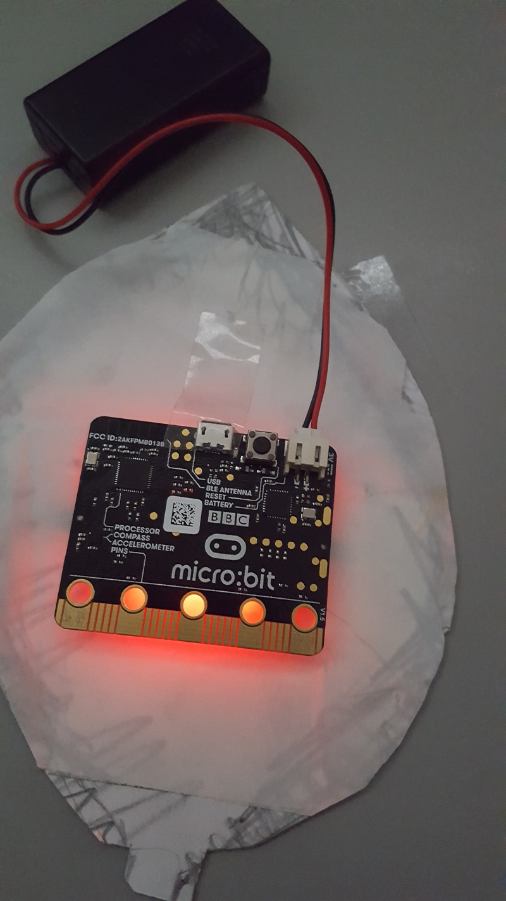
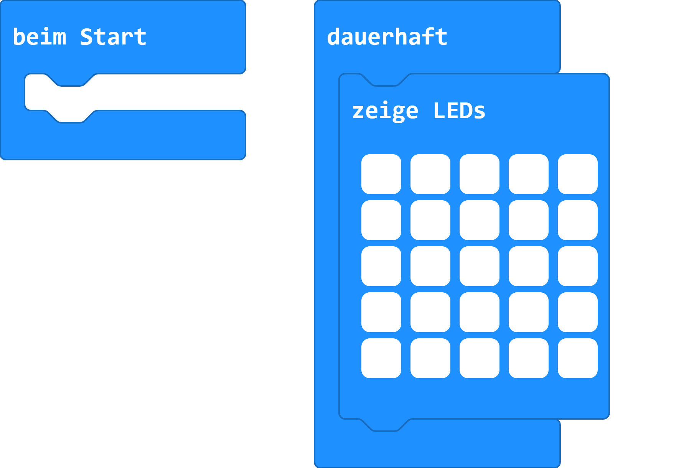

# Weihnachtskarte

## Material

+ mirco:bit
+ Tonpapier
+ Pergamentpapier
+ Kleber

#### Anleitung

<!--  -->

<!-- [Pumpkin-Jack-o-Lantern-face2.svg](images/Pumpkin-Jack-o-Lantern-face2.svg) -->

1. Einen Tannenbaum auf einen Bogen Tonpapier zeichnen
2. Einzelne Kugel mit einer Schere ausstanzen.
3. Die Größe so wählen, das der micro:bit gerade so rein passt. Nicht zu groß zeichnen.
4.  Die Rückseite mit einem Bogen Pergamentpapier bekleben.
5. Kleber gut trocken lassen.
6. Den micro:bit auf der Rückseite mit et was Klebestreifen befestigen.
7. Das Programm übertragen.
8. Programmstarten und die Weihnachtskarte leuchtet jetzt.

## Editor:

[https://makecode.microbit.org/](https://makecode.microbit.org/)

## Funktion:

### Vorderseite

### Rückseite

## Programmbeispiel
[microbit-christmascard.hex](appendix/microbit-christmascard.hex)
